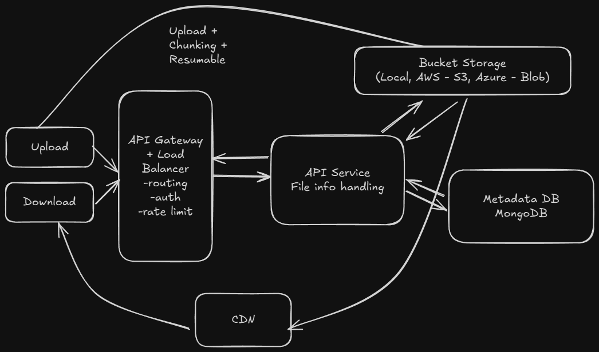
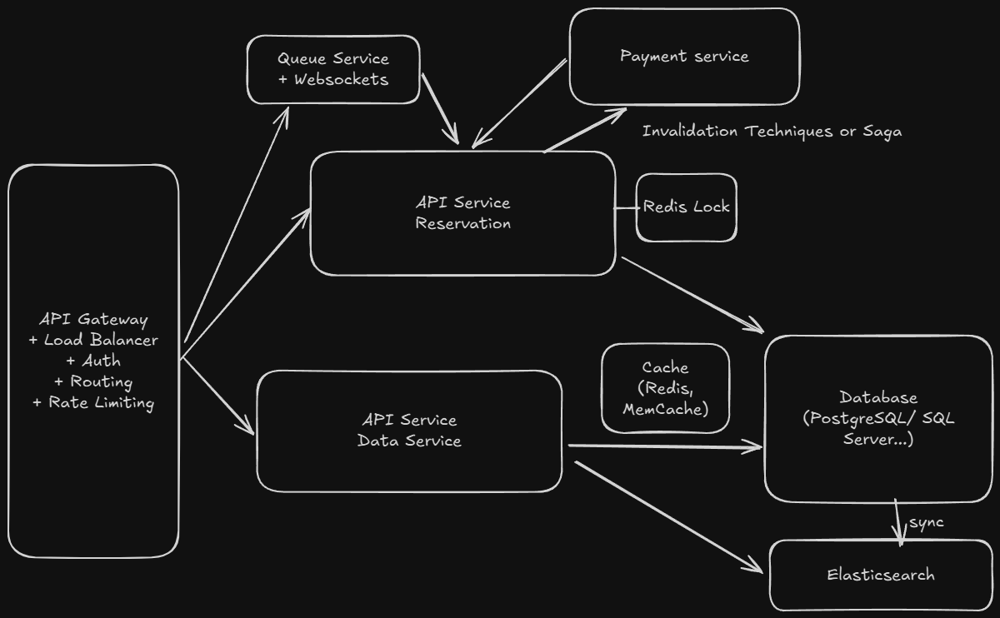
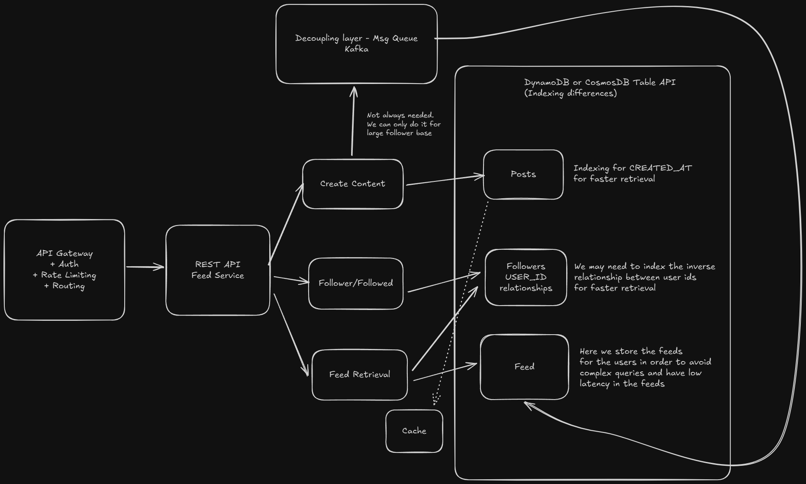
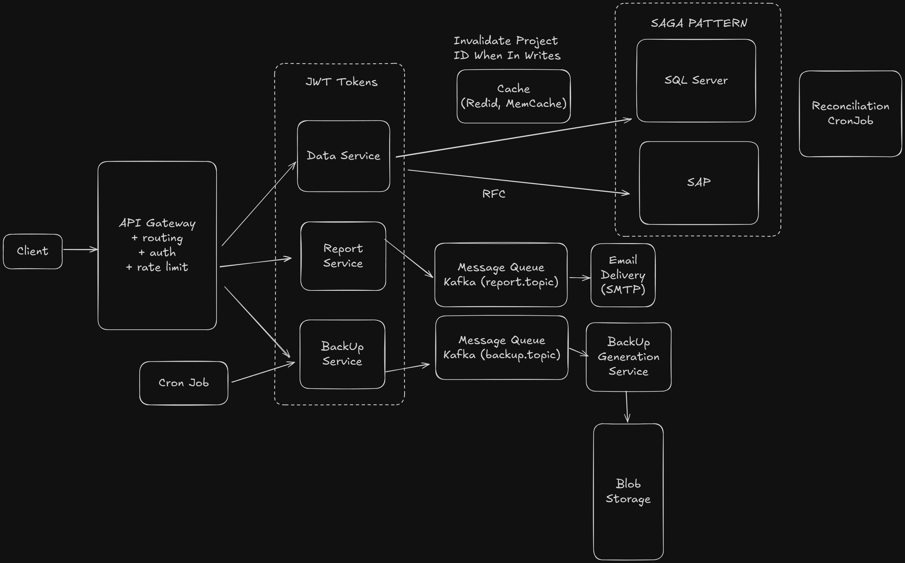
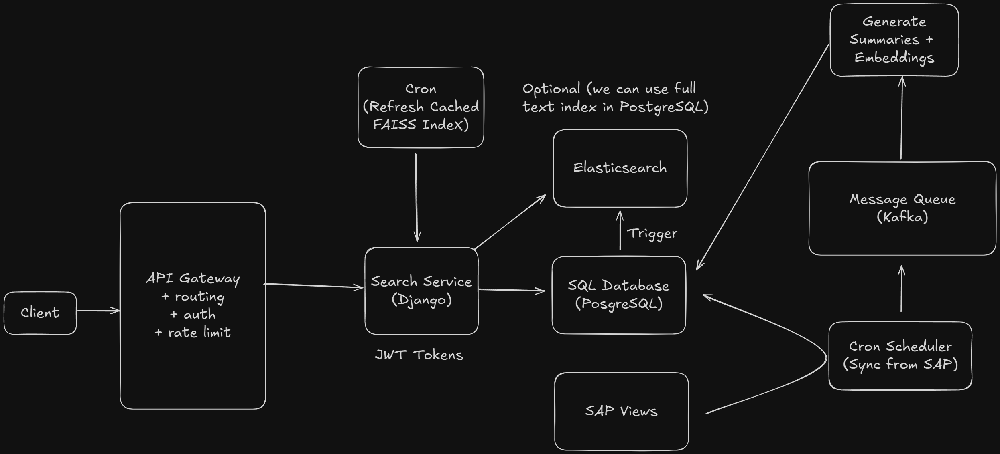

# Scalable System Architectures

**Note**: These are **personal examples** I work on in my spare time to demonstrate scalable architecture patterns and design thinking. They are **conceptual and illustrative** - not production-ready code.

## Overview

This repository showcases my understanding of building high-scale systems through hands-on learning projects. Each project focuses on specific scalability challenges and architectural patterns, designed to demonstrate knowledge of distributed systems concepts and trade-offs.

## System Design Projects

### [Cloud File Storage System](./cloud-file-storage/README.md)
**Challenge**: Handle large file uploads, cross-device sync, and secure sharing  
**Technologies**: S3, DynamoDB, CDN, signed URLs, chunked uploads  
**Focus**: Large file handling, deduplication, multi-device synchronization  
**Scale**: 50GB+ files, global file distribution



### [Ticket Booking System](./ticket-booking-system/README.md)
**Challenge**: Handle high-concurrency ticket reservations and prevent double booking  
**Technologies**: PostgreSQL, Redis, Kafka, WebSockets, Elasticsearch  
**Focus**: Optimistic concurrency control, real-time seatmap updates, virtual waiting rooms  
**Scale**: 10M+ concurrent users for popular events



### [Social News Feed System](./social-news-feed/README.md)
**Challenge**: Efficiently distribute posts to millions of followers with real-time updates  
**Technologies**: DynamoDB, Cassandra, Redis, Kafka, WebSockets  
**Focus**: Fan-out optimization, timeline management, hot user handling  
**Scale**: 2B+ users, millions of followers per celebrity



### [Enterprise Financial Integration System](./enterprise-financial-integration/README.md)
**Challenge**: Real-time data synchronization between SAP ERP and SQL Server with consistency guarantees  
**Technologies**: FastAPI, Kafka, SQL Server, SAP RFC, Redis, Kubernetes, Azure/AWS, Prometheus, Grafana  
**Focus**: SAGA pattern for billing consistency, async task processing, JWT auth, automated backups  
**Scale**: Multi-database consistency, high-concurrency reporting, per-project caching, 7-year retention



### [AI-Powered Document Search System](./ai-document-search/README.md)
**Challenge**: Semantic search across millions of SAP documents with AI-generated embeddings and summaries  
**Technologies**: Django, FastAPI, PostgreSQL (pgvector), MongoDB, FAISS, Elasticsearch, OpenAI API, TensorFlow, Kafka, AWS  
**Focus**: Hybrid search (semantic + keyword), multi-region deployment, embedding generation at scale  
**Scale**: Millions of documents, <500ms search latency, geographic distribution (EU + Chile)



## Tech Stack

- **Cloud**: AWS, Azure, GCP
- **Containers**: Docker, Kubernetes  
- **Databases**: PostgreSQL (+ pgvector), SQL Server, MongoDB, Redis, Elasticsearch
- **APIs**: FastAPI, Django REST, WebSockets
- **AI/ML**: OpenAI API, TensorFlow, FAISS, Sentence Transformers
- **Message Queues**: Apache Kafka, RabbitMQ
- **Monitoring**: Prometheus, Grafana, Jaeger
- **Infrastructure**: Terraform, Helm, GitHub Actions

## Project Structure

```
├── ticket-booking-system/      # High-concurrency ticket reservation system
│   └── README.md               # Complete system design and architecture
├── social-news-feed/           # Social media feed with fan-out challenges
│   └── README.md               # Complete system design and architecture  
├── cloud-file-storage/         # File storage with sync and sharing
│   └── README.md               # Complete system design and architecture
├── enterprise-financial-integration/  # SAP-SQL Server data synchronization
│   └── README.md               # Complete system design and architecture
├── ai-document-search/         # AI-powered semantic search with SAP integration
│   └── README.md               # Complete system design and architecture
└── README.md                   # This overview document
```

## Learning Objectives

- **Horizontal Scalability**: Design systems that scale across multiple servers
- **Fault Tolerance**: Build resilient systems that handle failures gracefully  
- **Performance Optimization**: Implement caching and load balancing strategies
- **Trade-off Analysis**: Balance consistency, latency, and throughput requirements

## Getting Started

Each project includes:
- Architecture diagrams and design decisions
- Conceptual implementation approaches (educational purposes)
- System design considerations and trade-offs
- Performance and scalability analysis
- Key learnings and insights

## Author

**Daniel G. de la Morena**  
**[LinkedIn](https://www.linkedin.com/in/daniel-gonzalez-de-la-morena/)**