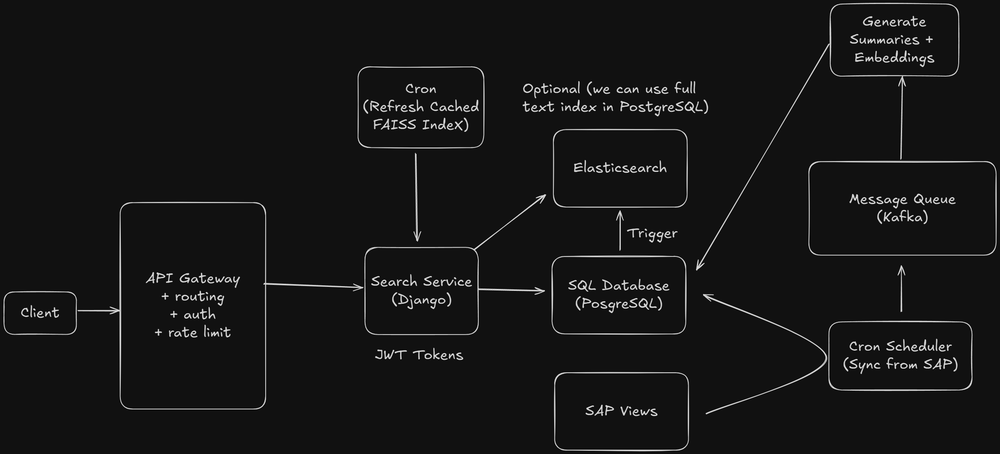

# AI-Powered Document Search System

## System Overview

An intelligent document search platform that integrates with SAP systems to provide AI-enhanced semantic search capabilities. The system periodically ingests documents from SAP SQL Views, generates embeddings and summaries using AI models, and enables hybrid search combining semantic similarity with traditional keyword search.

**Note**: This is a simplified representation of the actual production system, focusing on core architectural patterns and design decisions.

### Functional Requirements

1. System should periodically ingest documents from SAP SQL Views (read-only access)
2. System should detect changes in SAP documents using hash comparison
3. System should generate AI summaries and embeddings for documents
4. Users should be able to perform semantic search using natural language queries
5. Users should be able to perform hybrid search (semantic + keyword)
6. System should support geographic distribution with regional replicas

### Non-Functional Requirements

1. The system should handle large document collections (millions of documents)
2. The system should provide sub-second search response times (<500ms)
3. The system should maintain consistency between SAP and local stores
4. The system should scale horizontally for ingestion and search workloads
5. The system should support multi-region deployment for low-latency access
6. The system should provide comprehensive monitoring for embedding quality and search performance

## System Architecture



**Note**: A detailed ASCII architecture sketch is available in [`./assets/architecture-sketch.txt`](./assets/architecture-sketch.txt) for reference.

### High-Level Component Overview

| Layer | Description | Technologies |
|-------|-------------|--------------|
| **Ingestion & Primary Store** | FastAPI microservice periodically queries SAP SQL Views via ODBC/REST connector (read-only). Kubernetes CronJob detects new/modified records by comparing timestamps or hashes. Updated records stored in PostgreSQL (structured) and MongoDB (unstructured). Secured via AWS API Gateway with JWT authentication. | FastAPI, PostgreSQL, MongoDB, AWS API Gateway, OAuth2/JWT, Kubernetes CronJobs |
| **Change Detection & Propagation** | Ingestion job computes deltas between SAP data and local DB using hash comparison or timestamps. For each detected change, emits `document_changed` event to Kafka with version info and metadata for downstream processing. | Python, Kafka |
| **Summarization & Embeddings** | Python background workers subscribe to `document_changed` events. Generate AI summaries and embeddings using OpenAI API or TensorFlow models. Results stored in PostgreSQL (pgvector) and MongoDB. | Python, TensorFlow, OpenAI API, Kafka |
| **Vector & Metadata Storage** | Embeddings stored in pgvector table within PostgreSQL, linked to document metadata. Document metadata, attachments, and relationships in normalized SQL schemas. Unstructured summaries in MongoDB. | PostgreSQL (pgvector), MongoDB |
| **Hybrid Search & API Layer** | Django API provides unified search functionality combining semantic (FAISS + pgvector) and keyword search (PostgreSQL FTS or Elasticsearch). FAISS indexes refreshed on TTL schedule or embedding change events. Protected via AWS API Gateway. | Django, FAISS, PostgreSQL FTS / Elasticsearch, AWS API Gateway |
| **Consistency & Versioning** | Every document has content hash, SAP change timestamp, and local version. Django verifies hashes before FAISS refresh to avoid stale embeddings. Kafka guarantees ordered, idempotent propagation. | PostgreSQL, Kafka, Python |
| **Scheduling & Refresh Jobs** | Kubernetes CronJobs schedule all sync and refresh operations: SAP polling, FAISS TTL reloads, periodic consistency checks. Job results and metrics logged for monitoring. | Kubernetes CronJobs, FastAPI, Python |
| **Security & Access Control** | All services communicate through AWS API Gateway using JWT tokens. Internal services use service accounts and least-privilege IAM roles. | AWS API Gateway, JWT/OAuth2, AWS IAM |
| **Deployment & Monitoring** | Microservices deployed on Kubernetes with Prometheus + Grafana tracking embedding latency, queue lag, and version skew. | Kubernetes, Prometheus, Grafana |
| **Geographic Distribution** | MongoDB replica set and PostgreSQL read replica in Chile region. Kafka MirrorMaker replicates events between EU and Chile clusters. FastAPI search API routes queries to nearest region based on user location. | MongoDB replica, PostgreSQL replica, Kafka MirrorMaker, FastAPI |

## Data Models

1. **Document**: Core document entity with metadata (title, type, SAP ID, timestamps)
2. **DocumentVersion**: Tracks document versions with content hash and change timestamp
3. **DocumentEmbedding**: Vector embeddings (384 or 1536 dimensions) stored in pgvector
4. **DocumentSummary**: AI-generated summaries stored in MongoDB
5. **SearchIndex**: FAISS index metadata tracking index version and refresh timestamps
6. **SyncJob**: Records of SAP synchronization jobs with status and metrics

## Service Interfaces

### Search Documents
```
POST /api/v1/search
{
  "query": "Find all documents related to project budgets",
  "top_k": 10,
  "filters": {
    "document_type": "financial",
    "date_range": { "start": "2024-01-01", "end": "2024-12-31" }
  },
  "search_mode": "hybrid",  // "semantic" | "keyword" | "hybrid"
  "semantic_weight": 0.7    // optional, only for hybrid mode
}
-> {
  "results": [
    {
      "document_id": string,
      "title": string,
      "score": float,
      "summary": string,
      "metadata": {...}
    }
  ],
  "total_count": int,
  "query_time_ms": int
}
```

### Get Document Details
```
GET /api/v1/documents/:documentId
-> {
  "document_id": string,
  "title": string,
  "content": string,
  "summary": string,
  "metadata": {...},
  "related_documents": DocumentReference[],
  "version": int,
  "last_updated": timestamp
}
```

### Trigger SAP Sync (Manual)
```
POST /api/v1/sync/trigger
{
  "full_sync": boolean  // false = incremental, true = full resync
}
-> {
  "sync_job_id": string,
  "status": "QUEUED"
}
```

### Get Sync Status
```
GET /api/v1/sync/jobs/:jobId
-> {
  "job_id": string,
  "status": "QUEUED" | "RUNNING" | "COMPLETED" | "FAILED",
  "documents_processed": int,
  "documents_changed": int,
  "start_time": timestamp,
  "end_time": timestamp
}
```

## System Components

### 1) Ingestion & Primary Store

FastAPI microservice periodically queries SAP SQL Views to ingest documents, detecting changes via hash comparison.

**Components:**
- **FastAPI Ingestion Service**: Handles SAP data fetching and change detection
- **SAP ODBC/REST Connector**: Read-only access to SAP SQL Views
- **PostgreSQL**: Stores structured document metadata and embeddings
- **MongoDB**: Stores unstructured document content and summaries
- **AWS API Gateway**: Secures all external API access
- **Kubernetes CronJob**: Schedules periodic SAP synchronization

**Ingestion Flow:**
1. CronJob triggers ingestion service (e.g., every 15 minutes)
2. Service queries SAP SQL Views for all documents (or since last sync timestamp)
3. For each document, compute hash on our side (MD5 of content + metadata)
   - **Note**: SAP ODBC doesn't provide hash support, so we compute hashes locally
4. Compare computed hash with stored hash in PostgreSQL
5. If hash differs or document is new:
   - Store/update metadata in PostgreSQL
   - Store/update content in MongoDB
   - Emit `document_changed` event to Kafka
6. Update sync job status and metrics

**Change Detection Strategy:**

Since SAP ODBC doesn't provide built-in change tracking, we implement client-side change detection:

1. **Query SAP**: Fetch documents from SQL Views using timestamp filter (`CHANGED_AT > last_sync_time`)
2. **Compute Hash**: For each document, compute MD5 hash of `title + content + doc_type`
3. **Compare**: Check if hash exists in PostgreSQL and if it matches
4. **Detect Changes**:
   - New document: SAP ID not found in PostgreSQL
   - Updated document: SAP ID exists but hash differs
   - Unchanged: SAP ID exists and hash matches
5. **Store Changes**: Update PostgreSQL (metadata) and MongoDB (content) for new/changed documents
6. **Emit Events**: Publish `document_changed` event to Kafka for downstream processing

**Kubernetes CronJob Configuration:**
```yaml
apiVersion: batch/v1
kind: CronJob
metadata:
  name: sap-document-sync
spec:
  schedule: "*/15 * * * *"  # Every 15 minutes
  jobTemplate:
    spec:
      template:
        spec:
          containers:
          - name: ingestion-service
            image: fastapi-ingestion:latest
            env:
            - name: SAP_CONNECTION_STRING
              valueFrom:
                secretKeyRef:
                  name: sap-credentials
                  key: connection-string
            - name: SYNC_MODE
              value: "incremental"
          restartPolicy: OnFailure
```

### 2) Change Detection & Propagation

Ingestion service computes deltas and emits events to Kafka for downstream processing.

**Components:**
- **Delta Computation Engine**: Compares SAP data with local DB
- **Kafka Producer**: Publishes `document_changed` events
- **Event Schema**: Versioned event format for consistency

**Kafka Topics:**
- `document-changed`: Document create/update events
- `document-deleted`: Document deletion events
- `embedding-updated`: Embedding generation completion events
- `index-refresh`: FAISS index refresh triggers

**Event Schema:**
```python
from dataclasses import dataclass
from datetime import datetime
from typing import Optional

@dataclass
class DocumentChangedEvent:
    event_id: str
    event_type: str  # 'created' | 'updated'
    document_id: str
    sap_id: str
    content_hash: str
    previous_hash: Optional[str]
    changed_at: datetime
    version: int
    metadata: dict
    
    def to_kafka_message(self) -> dict:
        return {
            'event_id': self.event_id,
            'event_type': self.event_type,
            'document_id': self.document_id,
            'sap_id': self.sap_id,
            'content_hash': self.content_hash,
            'previous_hash': self.previous_hash,
            'changed_at': self.changed_at.isoformat(),
            'version': self.version,
            'metadata': self.metadata
        }
```

**Event Publishing:**
```python
from kafka import KafkaProducer
import json

class EventPublisher:
    def __init__(self, kafka_bootstrap_servers: str):
        self.producer = KafkaProducer(
            bootstrap_servers=kafka_bootstrap_servers,
            value_serializer=lambda v: json.dumps(v).encode('utf-8'),
            key_serializer=lambda k: k.encode('utf-8')
        )
    
    async def publish_document_changed(self, event: DocumentChangedEvent):
        """Publish document change event to Kafka"""
        try:
            future = self.producer.send(
                topic='document-changed',
                key=event.document_id,  # Partition by document_id for ordering
                value=event.to_kafka_message()
            )
            
            # Wait for confirmation
            record_metadata = future.get(timeout=10)
            
            logger.info(f"Published event {event.event_id} to partition {record_metadata.partition}")
            
        except Exception as e:
            logger.error(f"Failed to publish event {event.event_id}: {e}")
            raise
```

**Benefits:**
- Ordered processing per document (Kafka partitioning by document_id)
- Idempotent consumption via event_id deduplication
- Decoupling of ingestion and embedding generation
- Event replay capability for debugging

### 3) Summarization & Embeddings

Python workers consume document events and generate AI summaries and embeddings.

**Components:**
- **Kafka Consumer**: Subscribes to `document-changed` events
- **Summarization Engine**: OpenAI API or internal models
- **Embedding Generator**: OpenAI embeddings or TensorFlow models
- **Result Store**: PostgreSQL (embeddings) and MongoDB (summaries)

**Worker Implementation:**
```python
from kafka import KafkaConsumer
from openai import OpenAI
import tensorflow as tf
from typing import List
import numpy as np

class EmbeddingWorker:
    def __init__(self, config: dict):
        self.kafka_consumer = KafkaConsumer(
            'document-changed',
            bootstrap_servers=config['kafka_servers'],
            group_id='embedding-workers',
            auto_offset_reset='earliest',
            enable_auto_commit=False
        )
        
        self.openai_client = OpenAI(api_key=config['openai_api_key'])
        self.use_openai = config.get('use_openai', True)
        
        if not self.use_openai:
            # Load local TensorFlow model
            self.model = tf.keras.models.load_model('models/sentence_transformer')
    
    async def process_events(self):
        """Main event processing loop"""
        for message in self.kafka_consumer:
            event = json.loads(message.value)
            
            try:
                # Fetch document content
                document = await self.fetch_document(event['document_id'])
                
                # Generate summary
                summary = await self.generate_summary(document['content'])
                
                # Generate embedding
                embedding = await self.generate_embedding(
                    document['title'] + ' ' + summary
                )
                
                # Store results
                await self.store_results(
                    document_id=event['document_id'],
                    summary=summary,
                    embedding=embedding,
                    version=event['version']
                )
                
                # Publish completion event
                await self.publish_embedding_updated(event['document_id'])
                
                # Commit offset
                self.kafka_consumer.commit()
                
            except Exception as e:
                logger.error(f"Failed to process event: {e}")
                # Don't commit offset - will retry
    
    async def generate_summary(self, content: str) -> str:
        """Generate AI summary using OpenAI or local model"""
        if self.use_openai:
            response = self.openai_client.chat.completions.create(
                model="gpt-3.5-turbo",
                messages=[
                    {"role": "system", "content": "Summarize the following document concisely."},
                    {"role": "user", "content": content[:4000]}  # Limit to token budget
                ],
                max_tokens=200,
                temperature=0.3
            )
            return response.choices[0].message.content
        else:
            # Use local summarization model
            return self.local_summarize(content)
    
    async def generate_embedding(self, text: str) -> List[float]:
        """Generate vector embedding using OpenAI or TensorFlow"""
        if self.use_openai:
            response = self.openai_client.embeddings.create(
                model="text-embedding-ada-002",  # 1536 dimensions
                input=text[:8000]
            )
            return response.data[0].embedding
        else:
            # Use local embedding model (e.g., sentence-transformers)
            embedding = self.model.encode([text])[0]
            return embedding.tolist()
    
    async def store_results(
        self, 
        document_id: str, 
        summary: str, 
        embedding: List[float],
        version: int
    ):
        """Store summary in MongoDB and embedding in PostgreSQL"""
        # Store summary in MongoDB
        await self.mongo_client.summaries.update_one(
            {'document_id': document_id},
            {'$set': {
                'summary': summary,
                'generated_at': datetime.now(),
                'version': version
            }},
            upsert=True
        )
        
        # Store embedding in PostgreSQL with pgvector
        await self.db.execute("""
            INSERT INTO document_embeddings (document_id, embedding, version, created_at)
            VALUES (:doc_id, :embedding, :version, NOW())
            ON CONFLICT (document_id) 
            DO UPDATE SET 
                embedding = :embedding,
                version = :version,
                updated_at = NOW()
        """, {
            'doc_id': document_id,
            'embedding': embedding,
            'version': version
        })
```

**Embedding Storage Schema:**
```sql
-- PostgreSQL with pgvector extension
CREATE EXTENSION IF NOT EXISTS vector;

CREATE TABLE document_embeddings (
    id SERIAL PRIMARY KEY,
    document_id VARCHAR(100) UNIQUE NOT NULL,
    embedding vector(1536),  -- OpenAI ada-002 dimensions
    version INT NOT NULL,
    created_at TIMESTAMP DEFAULT NOW(),
    updated_at TIMESTAMP DEFAULT NOW(),
    FOREIGN KEY (document_id) REFERENCES documents(id)
);

-- Index for fast similarity search
CREATE INDEX ON document_embeddings 
USING ivfflat (embedding vector_cosine_ops) 
WITH (lists = 100);
```

### 4) Vector & Metadata Storage

Dual storage strategy: PostgreSQL for embeddings and structured data, MongoDB for unstructured content.

**PostgreSQL Schema:**
```sql
-- Documents table
CREATE TABLE documents (
    id VARCHAR(100) PRIMARY KEY,
    sap_id VARCHAR(100) UNIQUE NOT NULL,
    title TEXT NOT NULL,
    doc_type VARCHAR(50),
    content_hash VARCHAR(32) NOT NULL,
    version INT DEFAULT 1,
    changed_at TIMESTAMP NOT NULL,
    created_at TIMESTAMP DEFAULT NOW(),
    updated_at TIMESTAMP DEFAULT NOW()
);

CREATE INDEX idx_documents_sap_id ON documents(sap_id);
CREATE INDEX idx_documents_type ON documents(doc_type);
CREATE INDEX idx_documents_changed_at ON documents(changed_at DESC);

-- Full-text search index for keyword search
CREATE INDEX idx_documents_title_fts ON documents USING GIN(to_tsvector('english', title));

-- Document embeddings (see above)

-- Sync jobs tracking
CREATE TABLE sync_jobs (
    id SERIAL PRIMARY KEY,
    job_type VARCHAR(50) NOT NULL,
    status VARCHAR(20) NOT NULL,
    documents_processed INT DEFAULT 0,
    documents_changed INT DEFAULT 0,
    start_time TIMESTAMP NOT NULL,
    end_time TIMESTAMP,
    error_message TEXT,
    metadata JSONB
);
```

**MongoDB Collections:**
```javascript
// Document content collection
{
  _id: ObjectId,
  sap_id: String,
  content: String,  // Full document content
  metadata: {
    file_type: String,
    file_size: Number,
    changed_by: String,
    ingested_at: ISODate
  },
  attachments: [
    {
      name: String,
      url: String,
      size: Number
    }
  ]
}

// Document summaries collection
{
  _id: ObjectId,
  document_id: String,
  summary: String,
  summary_type: String,  // 'short' | 'long' | 'executive'
  generated_at: ISODate,
  generated_by: String,  // 'openai-gpt3.5' | 'tensorflow-model'
  version: Number,
  token_count: Number
}
```

### 5) Hybrid Search & API Layer

Django API provides unified search combining semantic (FAISS + pgvector) and keyword search (PostgreSQL FTS).

**Components:**
- **Django REST Framework**: API layer
- **FAISS Index**: In-memory vector index for fast similarity search
- **PostgreSQL FTS / Elasticsearch**: Full-text search for keyword queries
  - PostgreSQL FTS: Simpler, integrated with existing database
  - Elasticsearch: More powerful, better for complex search needs
- **AWS API Gateway**: Authentication and rate limiting

**Search Implementation Overview:**

The Django API provides a single unified `/search` endpoint that handles all search modes internally based on the `search_mode` parameter:

**Semantic Search Mode:**
1. Generate query embedding using OpenAI API or local model
2. Search FAISS index for top-K similar vectors (cosine similarity)
3. Fetch document metadata from PostgreSQL
4. Apply optional filters (document type, date range, etc.)
5. Fetch AI summaries from MongoDB
6. Return ranked results

**Keyword Search Mode:**
1. Use PostgreSQL Full-Text Search (FTS) on document titles and content
2. Rank results by relevance
3. Fetch summaries from MongoDB
4. Return results

**Alternative: Elasticsearch for Keyword Search**
- **PostgreSQL FTS** (Current):
  - Pros: Single database, simpler architecture, good for basic full-text search
  - Cons: Limited relevance tuning, less powerful than dedicated search engines
  
- **Elasticsearch** (Alternative):
  - Pros: Superior full-text search, better relevance scoring, faceted search, language analyzers, scalable
  - Cons: Additional infrastructure to manage, data synchronization needed
  - Implementation: Index documents from Kafka events alongside embedding generation
  - Use case: Better for complex search requirements, large document volumes

**Hybrid Search Mode:**
1. Execute semantic and keyword searches in parallel
2. Normalize scores to 0-1 range
3. Combine results with weighted scoring:
   - Default: 70% semantic + 30% keyword
   - Configurable via `semantic_weight` parameter
4. Merge and deduplicate results
5. Return top-K by combined score

**High-Level Service Structure:**
```python
class SearchService:
    async def search(self, query: str, mode: str, filters: dict = None):
        """Main search method that routes to appropriate search mode"""
        if mode == "semantic":
            return await self.semantic_search(query, filters)
        elif mode == "keyword":
            return await self.keyword_search(query, filters)
        elif mode == "hybrid":
            return await self.hybrid_search(query, filters)
    
    async def semantic_search(self, query: str, filters: dict):
        """Vector similarity search using FAISS"""
        # Generate embedding → Search FAISS → Fetch docs → Apply filters
        pass
    
    async def keyword_search(self, query: str, filters: dict):
        """Full-text search using PostgreSQL FTS"""
        # Use PostgreSQL FTS → Rank by relevance → Return results
        pass
    
    async def hybrid_search(self, query: str, filters: dict):
        """Weighted combination of semantic + keyword"""
        # Run both searches → Normalize scores → Combine with weights
        pass
```

**Django API Endpoint:**
```python
@app.post("/api/v1/search")
async def search_documents(request: SearchRequest):
    """
    Unified search endpoint handling semantic, keyword, and hybrid modes
    """
    results = await search_service.search(
        query=request.query,
        mode=request.search_mode,  # "semantic" | "keyword" | "hybrid"
        filters=request.filters,
        top_k=request.top_k,
        semantic_weight=request.semantic_weight
    )
    
    return {
        'results': results,
        'total_count': len(results),
        'query_time_ms': results.query_time
    }
```

**FAISS Index Refresh Strategy:**
```python
class FAISSRefreshWorker:
    """Worker to refresh FAISS index periodically or on-demand"""
    
    def __init__(self, refresh_interval_minutes: int = 60):
        self.refresh_interval = refresh_interval_minutes
        self.last_refresh = None
        self.kafka_consumer = KafkaConsumer('embedding-updated')
    
    async def run(self):
        """Main refresh loop"""
        while True:
            # Check if TTL-based refresh is needed
            if self.should_refresh_by_ttl():
                await self.refresh_index()
            
            # Check for embedding update events
            await self.check_embedding_events()
            
            await asyncio.sleep(60)  # Check every minute
    
    def should_refresh_by_ttl(self) -> bool:
        """Check if index should be refreshed based on TTL"""
        if not self.last_refresh:
            return True
        
        elapsed = (datetime.now() - self.last_refresh).total_seconds() / 60
        return elapsed >= self.refresh_interval
    
    async def check_embedding_events(self):
        """Check for embedding update events and refresh if needed"""
        messages = self.kafka_consumer.poll(timeout_ms=1000)
        
        if messages:
            # Embeddings updated, trigger refresh
            logger.info(f"Received {len(messages)} embedding updates, triggering refresh")
            await self.refresh_index()
    
    async def refresh_index(self):
        """Rebuild FAISS index from PostgreSQL"""
        logger.info("Starting FAISS index refresh")
        
        # Verify hash consistency before refresh
        if not await self.verify_hash_consistency():
            logger.error("Hash consistency check failed, aborting refresh")
            return
        
        # Rebuild index
        new_index = search_service.rebuild_faiss_index()
        
        # Atomic swap
        search_service.faiss_index = new_index
        
        self.last_refresh = datetime.now()
        logger.info("FAISS index refresh completed")
    
    async def verify_hash_consistency(self) -> bool:
        """Verify document hashes match between PostgreSQL and MongoDB"""
        # Fetch documents from PostgreSQL
        pg_docs = await db.query("""
            SELECT id, content_hash FROM documents
        """)
        
        # Fetch from MongoDB and compare
        for doc_id, pg_hash in pg_docs:
            mongo_doc = await mongo_client.documents.find_one({'document_id': doc_id})
            if mongo_doc:
                mongo_hash = hashlib.md5(mongo_doc['content'].encode()).hexdigest()
                if pg_hash != mongo_hash:
                    logger.error(f"Hash mismatch for document {doc_id}")
                    return False
        
        return True
```

### 6) Consistency & Versioning

Every document maintains version history and content hashes for consistency verification.

**Versioning Strategy:**
```python
class DocumentVersionManager:
    """Manages document versions and ensures consistency"""
    
    async def update_document_version(
        self,
        document_id: str,
        new_content: str,
        new_hash: str,
        sap_timestamp: datetime
    ) -> int:
        """Update document and increment version"""
        
        # Get current version
        current_doc = await db.query(Document).filter(
            Document.id == document_id
        ).first()
        
        new_version = (current_doc.version + 1) if current_doc else 1
        
        # Store version history
        version_record = DocumentVersion(
            document_id=document_id,
            version=new_version,
            content_hash=new_hash,
            sap_changed_at=sap_timestamp,
            created_at=datetime.now()
        )
        db.add(version_record)
        
        # Update current document
        if current_doc:
            current_doc.version = new_version
            current_doc.content_hash = new_hash
            current_doc.changed_at = sap_timestamp
            current_doc.updated_at = datetime.now()
        
        await db.commit()
        
        return new_version
```

**Idempotency via Event IDs:**
```python
class IdempotentEventProcessor:
    """Ensures events are processed exactly once"""
    
    def __init__(self):
        self.processed_events = set()  # In production, use Redis
    
    async def process_event(self, event: Dict) -> bool:
        """Process event if not already processed"""
        event_id = event['event_id']
        
        # Check if already processed
        if await self.is_processed(event_id):
            logger.info(f"Event {event_id} already processed, skipping")
            return False
        
        try:
            # Process event
            await self.handle_event(event)
            
            # Mark as processed
            await self.mark_processed(event_id)
            
            return True
            
        except Exception as e:
            logger.error(f"Failed to process event {event_id}: {e}")
            raise
    
    async def is_processed(self, event_id: str) -> bool:
        """Check if event was already processed"""
        # In production, use Redis
        return await redis_client.exists(f"event_processed:{event_id}")
    
    async def mark_processed(self, event_id: str):
        """Mark event as processed"""
        # Store in Redis with 7-day TTL
        await redis_client.setex(
            f"event_processed:{event_id}",
            7 * 24 * 3600,  # 7 days
            "1"
        )
```

### 7) Scheduling & Refresh Jobs

Kubernetes CronJobs handle all scheduled operations since SAP cannot trigger external actions.

**CronJob Definitions:**
```yaml
# SAP Document Sync (Every 15 minutes)
apiVersion: batch/v1
kind: CronJob
metadata:
  name: sap-document-sync
spec:
  schedule: "*/15 * * * *"
  jobTemplate:
    spec:
      template:
        spec:
          containers:
          - name: sync-job
            image: fastapi-ingestion:latest
            command: ["python", "-m", "jobs.sap_sync"]
            env:
            - name: SYNC_MODE
              value: "incremental"
          restartPolicy: OnFailure

---
# FAISS Index Refresh (Every hour)
apiVersion: batch/v1
kind: CronJob
metadata:
  name: faiss-index-refresh
spec:
  schedule: "0 * * * *"
  jobTemplate:
    spec:
      template:
        spec:
          containers:
          - name: index-refresh
            image: django-api:latest
            command: ["python", "manage.py", "refresh_faiss_index"]
          restartPolicy: OnFailure

---
# Consistency Check (Daily at 2 AM)
apiVersion: batch/v1
kind: CronJob
metadata:
  name: consistency-check
spec:
  schedule: "0 2 * * *"
  jobTemplate:
    spec:
      template:
        spec:
          containers:
          - name: consistency-check
            image: fastapi-ingestion:latest
            command: ["python", "-m", "jobs.consistency_check"]
          restartPolicy: OnFailure
```

**Job Monitoring:**
```python
class JobMonitor:
    """Monitor and track scheduled job executions"""
    
    async def record_job_execution(
        self,
        job_name: str,
        status: str,
        metrics: Dict
    ):
        """Record job execution in database"""
        job_record = SyncJob(
            job_type=job_name,
            status=status,
            documents_processed=metrics.get('documents_processed', 0),
            documents_changed=metrics.get('documents_changed', 0),
            start_time=metrics['start_time'],
            end_time=metrics.get('end_time'),
            error_message=metrics.get('error'),
            metadata=metrics.get('additional_data', {})
        )
        
        db.add(job_record)
        await db.commit()
        
        # Update Prometheus metrics
        job_duration_seconds.labels(job_name=job_name).observe(
            (metrics['end_time'] - metrics['start_time']).total_seconds()
        )
        
        job_status_total.labels(job_name=job_name, status=status).inc()
```

### 8) Security & Access Control

AWS API Gateway provides centralized authentication and authorization.

**AWS API Gateway Configuration:**
```yaml
# API Gateway with Lambda Authorizer
Resources:
  ApiGateway:
    Type: AWS::ApiGatewayV2::Api
    Properties:
      Name: DocumentSearchAPI
      ProtocolType: HTTP
      CorsConfiguration:
        AllowOrigins:
          - "*"
        AllowMethods:
          - GET
          - POST
        AllowHeaders:
          - Authorization
          - Content-Type
  
  JWTAuthorizer:
    Type: AWS::ApiGatewayV2::Authorizer
    Properties:
      ApiId: !Ref ApiGateway
      AuthorizerType: JWT
      IdentitySource:
        - $request.header.Authorization
      JwtConfiguration:
        Audience:
          - document-search-api
        Issuer: https://auth.company.com
```

**IAM Roles for Services:**
```python
# Service account with least-privilege access
class ServiceAuthenticator:
    """Authenticate internal services using IAM roles"""
    
    async def verify_service_account(self, request):
        """Verify service-to-service authentication"""
        # Extract service identity from request
        service_token = request.headers.get('X-Service-Token')
        
        if not service_token:
            raise AuthenticationError("Missing service token")
        
        # Verify using AWS IAM
        sts_client = boto3.client('sts')
        
        try:
            identity = sts_client.get_caller_identity()
            
            # Check if service has required permissions
            if not self.has_required_permissions(identity):
                raise AuthorizationError("Insufficient permissions")
            
            return identity
            
        except Exception as e:
            logger.error(f"Service authentication failed: {e}")
            raise
```


### 9) Deployment & Monitoring

Kubernetes deployment with comprehensive monitoring via Prometheus and Grafana.

**Deployment Architecture:**
```yaml
# Django API Deployment
apiVersion: apps/v1
kind: Deployment
metadata:
  name: django-search-api
spec:
  replicas: 3
  selector:
    matchLabels:
      app: django-api
  template:
    metadata:
      labels:
        app: django-api
    spec:
      containers:
      - name: django
        image: django-search-api:latest
        ports:
        - containerPort: 8000
        env:
        - name: DATABASE_URL
          valueFrom:
            secretKeyRef:
              name: db-credentials
              key: postgresql-url
        - name: MONGODB_URL
          valueFrom:
            secretKeyRef:
              name: db-credentials
              key: mongodb-url
        resources:
          requests:
            memory: "2Gi"
            cpu: "1000m"
          limits:
            memory: "4Gi"
            cpu: "2000m"
        livenessProbe:
          httpGet:
            path: /health
            port: 8000
          initialDelaySeconds: 30
          periodSeconds: 10
        readinessProbe:
          httpGet:
            path: /ready
            port: 8000
          initialDelaySeconds: 5
          periodSeconds: 5

---
# FastAPI Ingestion Service
apiVersion: apps/v1
kind: Deployment
metadata:
  name: fastapi-ingestion
spec:
  replicas: 2
  selector:
    matchLabels:
      app: fastapi-ingestion
  template:
    metadata:
      labels:
        app: fastapi-ingestion
    spec:
      containers:
      - name: fastapi
        image: fastapi-ingestion:latest
        ports:
        - containerPort: 8080
        env:
        - name: SAP_CONNECTION_STRING
          valueFrom:
            secretKeyRef:
              name: sap-credentials
              key: connection-string

---
# Embedding Workers
apiVersion: apps/v1
kind: Deployment
metadata:
  name: embedding-workers
spec:
  replicas: 5
  selector:
    matchLabels:
      app: embedding-worker
  template:
    metadata:
      labels:
        app: embedding-worker
    spec:
      containers:
      - name: worker
        image: embedding-worker:latest
        env:
        - name: OPENAI_API_KEY
          valueFrom:
            secretKeyRef:
              name: openai-credentials
              key: api-key
        - name: KAFKA_BOOTSTRAP_SERVERS
          value: "kafka:9092"
        resources:
          requests:
            memory: "4Gi"
            cpu: "2000m"
          limits:
            memory: "8Gi"
            cpu: "4000m"
```

**Monitoring:**
- Prometheus metrics for search latency, embedding generation, SAP sync duration
- Grafana dashboards for system health and business metrics
- Alerts for high latency, queue backlogs, and sync failures

### 10) Geographic Distribution (Chile Region)

Multi-region deployment for low-latency access from Chile.

**Architecture:**
```
EU Region (Primary):
- PostgreSQL (Primary)
- MongoDB (Primary Replica Set)
- Kafka Cluster
- Django API
- All CronJobs

Chile Region (Secondary):
- PostgreSQL (Read Replica)
- MongoDB (Secondary Replica)
- Kafka MirrorMaker (Consumer)
- Django API (Read-Only)
```

**MongoDB Replica Set:**
```javascript
// MongoDB replica set configuration
rs.initiate({
  _id: "document-search-rs",
  members: [
    { _id: 0, host: "mongo-eu-1:27017", priority: 2 },
    { _id: 1, host: "mongo-eu-2:27017", priority: 1 },
    { _id: 2, host: "mongo-chile-1:27017", priority: 0, tags: { region: "chile" } }
  ]
})

// Read preference for Chile region
db.documents.find().readPref("nearest", [{ region: "chile" }])
```

**PostgreSQL Replication:**
```sql
-- Primary (EU) configuration
wal_level = replica
max_wal_senders = 10
wal_keep_segments = 64

-- Read replica (Chile) configuration
hot_standby = on
max_standby_streaming_delay = 30s
```

**Kafka MirrorMaker:**
```properties
# MirrorMaker configuration
source.cluster.alias=eu
target.cluster.alias=chile

# Topics to replicate
topics=document-changed,embedding-updated,index-refresh

# Replication flow
eu->chile.enabled=true
chile->eu.enabled=false  # One-way replication
```

**AWS-Based Region Routing:**

**Option 1: AWS Route 53 Geolocation Routing**
- Configure Route 53 with geolocation routing policy
- Create DNS records for each region:
  - `api.company.com` → EU endpoint (default)
  - `api.company.com` → Chile endpoint (for South America geolocation)
- Route 53 automatically routes users to nearest region based on source IP
- Health checks ensure traffic fails over to healthy regions

**Option 2: AWS Global Accelerator**
- Create Global Accelerator with static anycast IPs
- Add endpoint groups for EU and Chile regions
- Configure traffic dials to control routing (e.g., 100% to nearest region)
- Automatic health checks and instant failover (<30 seconds)
- Benefits: Better performance, DDoS protection, static IPs

**Implementation:**
- Users connect to single global endpoint (e.g., `search.company.com`)
- AWS infrastructure routes to nearest healthy region automatically
- No application-level routing logic required
- Transparent to application code

## Technical Challenges

### Problem 1: Embedding Generation at Scale

**Problem**: Generating embeddings for millions of documents using OpenAI API is slow and expensive.

**Solution: Batching + Local Model Fallback**
```python
class ScalableEmbeddingGenerator:
    """Generate embeddings efficiently at scale"""
    
    def __init__(self):
        self.openai_client = OpenAI()
        self.local_model = SentenceTransformer('all-MiniLM-L6-v2')
        self.batch_size = 100
    
    async def generate_embeddings_batch(
        self,
        documents: List[Dict],
        use_openai: bool = True
    ) -> List[List[float]]:
        """Generate embeddings in batches"""
        
        if use_openai:
            # Batch OpenAI API calls (max 2048 per request)
            embeddings = []
            for i in range(0, len(documents), self.batch_size):
                batch = documents[i:i + self.batch_size]
                texts = [f"{doc['title']} {doc['summary']}" for doc in batch]
                
                response = await self.openai_client.embeddings.create(
                    model="text-embedding-ada-002",
                    input=texts
                )
                
                batch_embeddings = [item.embedding for item in response.data]
                embeddings.extend(batch_embeddings)
                
                # Rate limiting
                await asyncio.sleep(0.1)
            
            return embeddings
        else:
            # Use local model (faster, free, but lower quality)
            texts = [f"{doc['title']} {doc['summary']}" for doc in documents]
            return self.local_model.encode(texts, batch_size=32).tolist()
```

**Benefits:**
- 10x faster than sequential processing
- Cost reduction via batching
- Fallback to local models when needed
- GPU acceleration for local models

### Problem 2: FAISS Index Staleness

**Problem**: FAISS index becomes stale as documents are updated, leading to incorrect search results.

**Solution: Event-Driven Index Refresh with Hash Verification**
```python
class SmartIndexRefresher:
    """Intelligently refresh FAISS index based on changes"""
    
    def __init__(self):
        self.change_threshold = 100  # Refresh after 100 changes
        self.changes_since_refresh = 0
        self.last_refresh = datetime.now()
    
    async def on_embedding_updated(self, event: Dict):
        """Handle embedding update event"""
        self.changes_since_refresh += 1
        
        # Incremental update for small changes
        if self.changes_since_refresh < self.change_threshold:
            await self.incremental_update(event['document_id'])
        else:
            # Full refresh for large changes
            await self.full_refresh()
    
    async def incremental_update(self, document_id: str):
        """Update single document in FAISS index"""
        # Fetch new embedding
        embedding = await self.fetch_embedding(document_id)
        
        # Remove old vector (if exists)
        old_index = self.find_document_index(document_id)
        if old_index is not None:
            self.faiss_index.remove_ids(np.array([old_index]))
        
        # Add new vector
        self.faiss_index.add(np.array([embedding]))
        
        logger.info(f"Incrementally updated document {document_id}")
    
    async def full_refresh(self):
        """Full FAISS index rebuild"""
        logger.info("Starting full FAISS refresh")
        
        # Verify hash consistency
        inconsistencies = await self.verify_consistency()
        
        if inconsistencies:
            logger.error(f"Found {len(inconsistencies)} hash mismatches")
            await self.alert_inconsistencies(inconsistencies)
            return
        
        # Rebuild index
        new_index = await self.rebuild_index()
        
        # Atomic swap
        self.faiss_index = new_index
        self.changes_since_refresh = 0
        self.last_refresh = datetime.now()
        
        logger.info("Full FAISS refresh completed")
```

### Problem 3: Multi-Region Data Consistency

**Problem**: Chile replica may lag behind EU primary, causing stale search results.

**Solution: Read-Your-Writes Consistency**
```python
class ConsistentRegionalRead:
    """Ensure read-your-writes consistency across regions"""
    
    async def search_with_consistency(
        self,
        query: str,
        user_id: str,
        region: str
    ):
        """Search with consistency guarantees"""
        
        # Check if user has recent writes
        latest_write = await self.get_user_latest_write(user_id)
        
        if latest_write:
            # Check replication lag
            lag = await self.check_replication_lag(region)
            
            if lag > (datetime.now() - latest_write['timestamp']).total_seconds():
                # Lag is too high, route to primary
                logger.info(f"Routing to primary due to replication lag")
                return await self.search_in_region('eu', query)
        
        # Safe to search in local region
        return await self.search_in_region(region, query)
    
    async def check_replication_lag(self, region: str) -> float:
        """Check replication lag in seconds"""
        if region == 'chile':
            # Check PostgreSQL replication lag
            result = await db.execute("""
                SELECT EXTRACT(EPOCH FROM (NOW() - pg_last_xact_replay_timestamp()))
                AS lag_seconds
            """)
            return result.scalar()
        
        return 0  # Primary has no lag
```

### Problem 4: SAP Connection Reliability

**Problem**: SAP ODBC connections can be unstable, causing sync job failures.

**Solution: Retry with Exponential Backoff**
```python
import tenacity

class ResilientSAPConnector:
    """SAP connector with retry logic"""
    
    @tenacity.retry(
        stop=tenacity.stop_after_attempt(5),
        wait=tenacity.wait_exponential(multiplier=1, min=2, max=60),
        retry=tenacity.retry_if_exception_type(pyodbc.Error),
        before_sleep=lambda retry_state: logger.warning(
            f"SAP connection failed, retrying... (attempt {retry_state.attempt_number})"
        )
    )
    async def query_documents(self, query: str):
        """Query SAP with automatic retry"""
        try:
            cursor = self.conn.cursor()
            cursor.execute(query)
            return cursor.fetchall()
        except pyodbc.Error as e:
            logger.error(f"SAP query failed: {e}")
            # Reconnect before retry
            self.conn = pyodbc.connect(self.connection_string)
            raise
```

### Problem 5: Search Quality Measurement

**Problem**: Difficult to measure semantic search quality and relevance.

**Solution: Embedding Quality Metrics + User Feedback**
```python
class SearchQualityMonitor:
    """Monitor and improve search quality"""
    
    async def log_search_interaction(
        self,
        query: str,
        results: List[Dict],
        user_id: str
    ):
        """Log search for quality analysis"""
        search_log = {
            'query': query,
            'timestamp': datetime.now(),
            'user_id': user_id,
            'results_count': len(results),
            'top_5_docs': [r['document_id'] for r in results[:5]]
        }
        
        await self.mongo_client.search_logs.insert_one(search_log)
    
    async def track_user_feedback(
        self,
        search_id: str,
        document_id: str,
        action: str  # 'clicked' | 'ignored' | 'helpful' | 'not_helpful'
    ):
        """Track user interaction with search results"""
        feedback = {
            'search_id': search_id,
            'document_id': document_id,
            'action': action,
            'timestamp': datetime.now()
        }
        
        await self.mongo_client.search_feedback.insert_one(feedback)
        
        # Update relevance metrics
        await self.update_relevance_scores(search_id, document_id, action)
    
    async def compute_search_metrics(self) -> Dict:
        """Compute search quality metrics"""
        # Click-through rate
        total_searches = await self.mongo_client.search_logs.count_documents({})
        searches_with_clicks = await self.mongo_client.search_feedback.distinct('search_id')
        ctr = len(searches_with_clicks) / total_searches if total_searches > 0 else 0
        
        # Mean Reciprocal Rank (MRR)
        mrr = await self.compute_mrr()
        
        # Average query latency
        avg_latency = await self.compute_avg_latency()
        
        return {
            'click_through_rate': ctr,
            'mean_reciprocal_rank': mrr,
            'avg_query_latency_ms': avg_latency,
            'total_searches': total_searches
        }
```

## Architecture Summary

**Key Design Principles:**
- **AI-First Search**: Semantic search using embeddings for natural language queries
- **Unified Search Endpoint**: Single `/search` API with configurable modes (semantic, keyword, hybrid)
- **Hybrid Search Strategy**: Combines vector similarity (FAISS) with keyword search (PostgreSQL FTS or Elasticsearch) with weighted scoring
- **Event-Driven Pipeline**: Kafka decouples ingestion, embedding generation, and index refresh
- **SAP Read-Only Integration**: Periodic polling via ODBC/REST with client-side hash-based change detection
- **Multi-Region Deployment**: AWS Route 53 or Global Accelerator for geographic routing to EU and Chile regions
- **Scheduled Operations**: Kubernetes CronJobs handle all SAP sync and FAISS refresh operations
- **Versioning & Consistency**: Hash-based verification prevents stale embeddings

**Technology Stack:**
- **APIs**: FastAPI (ingestion), Django (search)
- **Databases**: PostgreSQL + pgvector (embeddings), MongoDB (content)
- **Search**: FAISS (vector similarity), PostgreSQL FTS or Elasticsearch (keyword)
- **AI/ML**: OpenAI API (embeddings/summarization), TensorFlow (local models)
- **Messaging**: Kafka (event streaming)
- **Security**: AWS API Gateway, JWT/OAuth2, AWS IAM
- **Deployment**: Kubernetes, Prometheus, Grafana
- **Geographic**: MongoDB replica sets, PostgreSQL read replicas, Kafka MirrorMaker

**Scalability Features:**
- Horizontal scaling for all services (API, workers, search)
- FAISS index supports millions of vectors with sub-second search
- Kafka enables async processing of embedding generation
- Multi-region deployment for global access
- Batch embedding generation reduces API costs by 10x

**Search Performance:**
- Semantic search: <500ms for top-10 results
- Hybrid search: <800ms combining semantic + keyword
- FAISS index refresh: <5 minutes for 1M documents
- SAP sync: 15-minute intervals, processes 10K documents/min

**Consistency Guarantees:**
- Hash verification before FAISS refresh
- Idempotent event processing via event IDs
- Version tracking for all documents
- Read-your-writes consistency in multi-region setup
- Ordered processing per document via Kafka partitioning

This architecture enables intelligent document search across large SAP document collections, providing users with powerful semantic search capabilities while maintaining consistency and performance at scale.

