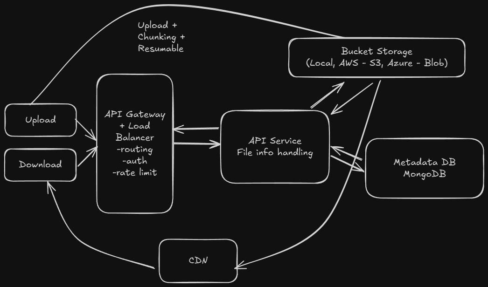

# Cloud File Storage System Architecture

## System Overview

A cloud-based file storage service that allows users to store, sync, and share files across devices. The system must handle large files up to 50GB while providing fast upload/download speeds and reliable file synchronization across multiple devices.

### Functional Requirements

1. Users should be able to upload files from any device
2. Users should be able to download files from any device
3. Users should be able to share files with other users
4. Users can automatically sync files across devices

### Non-Functional Requirements

1. The system should prioritize availability over consistency (eventual consistency acceptable)
2. The system should support files as large as 50GB
3. The system should be secure and reliable with file recovery capabilities
4. Upload, download, and sync operations should be fast (low latency)

## System Architecture



## Data Models

1. **User**: Represents users in the system
2. **File**: Raw file data stored in blob storage
3. **FileMetadata**: Metadata associated with files (name, size, type, owner, etc.)
4. **Share**: Sharing relationships between users and files

## Service Interfaces

### Upload File
```
POST /files
{
  "fileName": "document.pdf",
  "fileSize": 1048576,
  "mimeType": "application/pdf"
}
→ 200 OK
{
  "fileId": "file123",
  "uploadUrl": "https://storage.com/upload/file123"
}
```

### Download File
```
GET /files/{fileId}
→ 200 OK
{
  "fileId": "file123",
  "fileName": "document.pdf",
  "downloadUrl": "https://storage.com/download/file123",
  "expiresAt": "2024-01-15T11:30:00Z"
}
```

### Share File
```
POST /files/{fileId}/share
{
  "userId": "user456",
  "permissions": ["read"]
}
→ 200 OK
{
  "shareId": "share789"
}
```

### Get File Changes
```
GET /files/{fileId}/changes?since=2024-01-15T10:00:00Z
→ 200 OK
{
  "changes": [
    {
      "type": "modified",
      "timestamp": "2024-01-15T10:30:00Z",
      "version": 2
    }
  ]
}
```

## System Architecture

### 1) Users should be able to upload files

**Components:**
- **API Gateway**: Handle routing and authentication
- **File Service**: Process file metadata and upload requests
- **Blob Storage**: Store actual file data (S3-compatible)
- **Metadata Database**: Store file information and relationships

**Data Flow:**
1. User initiates file upload
2. File Service validates request and generates unique file ID
3. Returns signed upload URL for direct blob storage access
4. User uploads file directly to blob storage
5. File Service receives upload completion notification
6. Metadata stored in database with file status

### 2) Users should be able to download files

**Components:**
- **File Service**: Handle download requests and authorization
- **Blob Storage**: Serve file data
- **CDN**: Cache popular files for faster downloads
- **Signed URLs**: Secure, time-limited download links

**Data Flow:**
1. User requests file download
2. File Service validates permissions
3. Generates signed download URL with expiration
4. User downloads file directly from blob storage/CDN
5. Download activity logged for analytics

### 3) Users should be able to share files

**Components:**
- **Share Service**: Manage file sharing permissions
- **Access Control**: Enforce sharing policies
- **Notification Service**: Notify users of shared files

**Implementation:**
- Store sharing relationships in database
- Generate secure share links with expiration
- Support different permission levels (read, write)

### 4) Users can sync files across devices

**Components:**
- **Sync Service**: Track file changes and versions
- **Change Detection**: Identify modified files
- **Conflict Resolution**: Handle simultaneous edits

**Sync Process:**
1. Device checks for remote changes
2. Downloads new/modified files
3. Uploads local changes to server
4. Resolves conflicts when multiple devices edit same file

## Implementation Details

### File Upload Strategy

**Multipart Upload for Large Files:**
```python
class FileUploadService:
    def __init__(self, blob_storage, metadata_db):
        self.storage = blob_storage
        self.db = metadata_db
    
    def initiate_upload(self, file_name, file_size, user_id):
        file_id = generate_file_id()
        
        if file_size > LARGE_FILE_THRESHOLD:
            # Initiate multipart upload
            upload_id = self.storage.create_multipart_upload(file_id)
            return {
                'fileId': file_id,
                'uploadId': upload_id,
                'chunkSize': CHUNK_SIZE,
                'totalChunks': math.ceil(file_size / CHUNK_SIZE)
            }
        else:
            # Single upload
            upload_url = self.storage.get_presigned_upload_url(file_id)
            return {
                'fileId': file_id,
                'uploadUrl': upload_url
            }
    
    def upload_chunk(self, file_id, upload_id, chunk_number, chunk_data):
        # Upload individual chunk
        etag = self.storage.upload_part(file_id, upload_id, chunk_number, chunk_data)
        return {'etag': etag}
    
    def complete_upload(self, file_id, upload_id, parts):
        # Complete multipart upload
        file_url = self.storage.complete_multipart_upload(file_id, upload_id, parts)
        
        # Update metadata
        self.db.update_file_status(file_id, 'completed', file_url)
        return {'status': 'completed'}
```
- Chunked upload for files > 100MB
- Resumable uploads with progress tracking
- Automatic retry for failed chunks

### File Download Strategy

**Optimized Download with CDN:**
```python
class FileDownloadService:
    def __init__(self, blob_storage, cdn, metadata_db):
        self.storage = blob_storage
        self.cdn = cdn
        self.db = metadata_db
    
    def get_download_url(self, file_id, user_id):
        # Check permissions
        if not self.has_download_permission(file_id, user_id):
            raise PermissionError()
        
        # Check if file is cached in CDN
        cdn_url = self.cdn.get_cached_url(file_id)
        if cdn_url:
            return {
                'downloadUrl': cdn_url,
                'source': 'cdn',
                'expiresAt': self.get_cdn_expiry()
            }
        
        # Generate signed URL from blob storage
        signed_url = self.storage.get_presigned_download_url(file_id)
        return {
            'downloadUrl': signed_url,
            'source': 'storage',
            'expiresAt': self.get_signed_url_expiry()
        }
```
- CDN caching for frequently accessed files
- Signed URLs with 1-hour expiration
- Bandwidth optimization through compression

### Database Schema Design

**File Metadata Table (DynamoDB):**
```sql
CREATE TABLE FileMetadata (
    fileId STRING PRIMARY KEY,
    fileName STRING,
    fileSize NUMBER,
    mimeType STRING,
    ownerId STRING,
    createdAt TIMESTAMP,
    updatedAt TIMESTAMP,
    status STRING,  -- uploading, completed, deleted
    storageUrl STRING
);
```

**Shares Table (DynamoDB):**
```sql
CREATE TABLE Shares (
    shareId STRING PRIMARY KEY,
    fileId STRING,
    ownerId STRING,
    sharedWithId STRING,
    permissions STRING,  -- read, write
    createdAt TIMESTAMP,
    expiresAt TIMESTAMP
);
```

**File Changes Table (Cassandra):**
```sql
CREATE TABLE FileChanges (
    fileId STRING,
    deviceId STRING,
    version NUMBER,
    changeType STRING,  -- created, modified, deleted
    timestamp TIMESTAMP,
    PRIMARY KEY (fileId, deviceId, version)
);
```

## Technical Challenges

### Problem 1: Handling Large File Uploads

**Problem**: Files up to 50GB can timeout during upload and consume excessive bandwidth.

**Solution: Chunked Upload with Resume Capability**
```python
class ChunkedUploadManager:
    def __init__(self, storage, metadata_db):
        self.storage = storage
        self.db = metadata_db
    
    def upload_large_file(self, file_id, file_path, chunk_size=5*1024*1024):
        file_size = os.path.getsize(file_path)
        total_chunks = math.ceil(file_size / chunk_size)
        
        # Initiate multipart upload
        upload_id = self.storage.create_multipart_upload(file_id)
        
        uploaded_parts = []
        for chunk_num in range(total_chunks):
            start_byte = chunk_num * chunk_size
            end_byte = min(start_byte + chunk_size, file_size)
            
            # Upload chunk with retry logic
            etag = self.upload_chunk_with_retry(
                file_id, upload_id, chunk_num, 
                file_path, start_byte, end_byte
            )
            uploaded_parts.append({'partNumber': chunk_num + 1, 'etag': etag})
        
        # Complete upload
        return self.storage.complete_multipart_upload(file_id, upload_id, uploaded_parts)
    
    def resume_upload(self, file_id, upload_id, uploaded_chunks):
        # Continue from last uploaded chunk
        remaining_chunks = self.get_remaining_chunks(uploaded_chunks)
        return self.upload_remaining_chunks(file_id, upload_id, remaining_chunks)
```
- 5MB chunks for optimal throughput
- Automatic retry with exponential backoff
- Resume capability for interrupted uploads

### Problem 2: Efficient File Synchronization

**Problem**: Multiple devices need to sync files efficiently without conflicts.

**Solution: Version-based Sync with Conflict Resolution**
```python
class FileSyncService:
    def __init__(self, metadata_db, change_tracker):
        self.db = metadata_db
        self.changes = change_tracker
    
    def sync_device(self, device_id, last_sync_time):
        # Get files changed since last sync
        changed_files = self.changes.get_changes_since(device_id, last_sync_time)
        
        sync_plan = []
        for file_change in changed_files:
            if file_change['type'] == 'remote_modified':
                sync_plan.append({
                    'action': 'download',
                    'fileId': file_change['fileId'],
                    'version': file_change['version']
                })
            elif file_change['type'] == 'local_modified':
                sync_plan.append({
                    'action': 'upload',
                    'fileId': file_change['fileId'],
                    'localVersion': file_change['localVersion']
                })
        
        return self.execute_sync_plan(sync_plan)
    
    def handle_conflict(self, file_id, local_version, remote_version):
        # Conflict resolution strategy
        if local_version > remote_version:
            return 'keep_local'
        elif remote_version > local_version:
            return 'keep_remote'
        else:
            # Same version, keep both with timestamp suffix
            return 'keep_both'
```
- Last-write-wins conflict resolution
- Version tracking for each file
- Efficient change detection

### Problem 3: Secure File Sharing

**Problem**: Files must be shared securely with proper access control.

**Solution: Signed URLs with Access Control**
```python
class SecureSharingService:
    def __init__(self, storage, metadata_db):
        self.storage = storage
        self.db = metadata_db
    
    def share_file(self, file_id, owner_id, shared_with_id, permissions):
        # Create share record
        share_id = generate_share_id()
        self.db.create_share(share_id, file_id, owner_id, shared_with_id, permissions)
        
        # Generate secure share link
        share_url = self.generate_share_url(share_id)
        return {
            'shareId': share_id,
            'shareUrl': share_url,
            'expiresAt': datetime.now() + timedelta(days=7)
        }
    
    def validate_share_access(self, share_id, user_id):
        share = self.db.get_share(share_id)
        
        if not share or share['expiresAt'] < datetime.now():
            raise AccessDeniedError()
        
        # Check if user has access
        if share['sharedWithId'] != user_id and share['ownerId'] != user_id:
            raise AccessDeniedError()
        
        return share
    
    def generate_download_url(self, share_id, user_id):
        share = self.validate_share_access(share_id, user_id)
        
        # Generate time-limited signed URL
        signed_url = self.storage.get_presigned_url(
            share['fileId'], 
            expires_in=3600  # 1 hour
        )
        
        return {
            'downloadUrl': signed_url,
            'expiresAt': datetime.now() + timedelta(hours=1)
        }
```
- Time-limited share links (7-day expiration)
- Signed URLs for secure downloads (1-hour expiration)
- Granular permission control

### Problem 4: Storage Optimization

**Problem**: Duplicate files consume excessive storage space.

**Solution: Deduplication with Content Addressing**
```python
class DeduplicationService:
    def __init__(self, storage, metadata_db):
        self.storage = storage
        self.db = metadata_db
    
    def deduplicate_file(self, file_data):
        # Generate content hash
        content_hash = hashlib.sha256(file_data).hexdigest()
        
        # Check if file already exists
        existing_file = self.db.get_file_by_hash(content_hash)
        if existing_file:
            # Increment reference count
            self.db.increment_reference_count(content_hash)
            return {
                'fileId': existing_file['fileId'],
                'isDeduplicated': True,
                'originalFileId': existing_file['fileId']
            }
        
        # Store new file
        file_id = generate_file_id()
        self.storage.store_file(file_id, file_data)
        
        # Store metadata with content hash
        self.db.store_file_metadata(file_id, content_hash, len(file_data))
        
        return {
            'fileId': file_id,
            'isDeduplicated': False
        }
    
    def cleanup_unreferenced_files(self):
        # Find files with zero references
        orphaned_files = self.db.get_orphaned_files()
        
        for file_id in orphaned_files:
            self.storage.delete_file(file_id)
            self.db.delete_file_metadata(file_id)
```
- SHA-256 content hashing for deduplication
- Reference counting for shared files
- Automatic cleanup of orphaned files

### Problem 5: High Availability and Backup

**Problem**: File loss must be prevented with reliable backup and recovery.

**Solution: Multi-Region Replication with Versioning**
```python
class BackupAndRecoveryService:
    def __init__(self, storage, metadata_db):
        self.storage = storage
        self.db = metadata_db
    
    def backup_file(self, file_id, regions=['us-east-1', 'eu-west-1', 'ap-southeast-1']):
        file_data = self.storage.get_file(file_id)
        
        # Replicate to multiple regions
        backup_results = []
        for region in regions:
            backup_url = self.storage.replicate_to_region(file_id, file_data, region)
            backup_results.append({
                'region': region,
                'backupUrl': backup_url,
                'status': 'completed'
            })
        
        # Update backup metadata
        self.db.update_backup_info(file_id, backup_results)
        return backup_results
    
    def recover_file(self, file_id, target_region):
        # Get backup locations
        backup_info = self.db.get_backup_info(file_id)
        
        # Find available backup
        for backup in backup_info['backups']:
            if backup['status'] == 'completed':
                # Restore from backup
                recovered_url = self.storage.restore_from_backup(
                    file_id, backup['backupUrl'], target_region
                )
                return {
                    'fileId': file_id,
                    'recoveredUrl': recovered_url,
                    'sourceRegion': backup['region']
                }
        
        raise FileRecoveryError("No available backup found")
```
- Cross-region replication for disaster recovery
- Version history for file recovery
- Automated backup verification

### Component Responsibilities

**API Gateway:**
- Request routing and load balancing
- Authentication and authorization
- Rate limiting and throttling

**File Service:**
- Handle file upload/download requests
- Manage file metadata and permissions
- Coordinate with blob storage

**Share Service:**
- Manage file sharing permissions
- Generate secure share links
- Enforce access control policies

**Sync Service:**
- Track file changes across devices
- Handle conflict resolution
- Manage version control

**Blob Storage:**
- Store actual file data
- Provide high-availability storage
- Support multipart uploads

**Data Storage:**
- **DynamoDB**: File metadata and sharing information
- **Cassandra**: File change tracking and version history
- **S3**: Blob storage with cross-region replication
- **CDN**: Caching for frequently accessed files

## Architecture Summary

**Key Design Principles:**
- **Chunked Upload**: Handle large files with resumable uploads
- **Multi-Region Storage**: Ensure high availability and disaster recovery
- **Content Deduplication**: Optimize storage usage
- **Signed URLs**: Secure file access with time-limited permissions
- **Version Control**: Track file changes and resolve conflicts
- **CDN Integration**: Accelerate file downloads globally

This design handles the core challenges of a cloud file storage system while maintaining high performance, reliability, and security for files up to 50GB.
