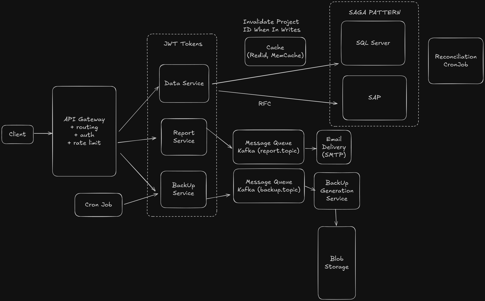

# Enterprise Financial Integration System

## System Overview

A real-time financial data integration platform that synchronizes data between SAP ERP systems (via RFC calls) and extended SQL Server databases, enabling unified reporting and compliance monitoring for enterprise financial operations.

**Note**: This is a simplified representation of the actual production system, focusing on core architectural patterns and design decisions.

### Functional Requirements

1. Users should be able to fetch project lists with pricing, billing, outsourcing, resource planning, and metadata
2. Users should be able to retrieve resource (people) data with hourly costs
3. Users should be able to query central cost center planning data by year and department
4. System should generate consolidated financial reports (Excel, PDF) asynchronously
5. System should provide manual and automated backup capabilities

### Non-Functional Requirements

1. The system should maintain data consistency for billing operations between SAP and SQL Server using SAGA pattern
2. The system requires SAP to be operational - no functionality available during SAP downtime
3. The system should handle high concurrency during reporting periods (e.g., coordination meetings)
4. The system should provide low-latency data access through per-project caching (< 200ms for cached queries)
5. The system should scale independently for API, report generation, and backup workloads
6. The system should maintain compliance with automated weekly backups and 7-year retention
7. The system should provide comprehensive monitoring with Prometheus/Grafana across all layers

## System Architecture



### High-Level Component Overview

| Layer | Description | Technologies |
|-------|-------------|--------------|
| **Ingestion & Security Gateway** | FastAPI service acts as the API Gateway, handling rate limiting, JWT authentication, and data orchestration. Fetches real-time financial data from SAP (via RFC calls) and SQL Server, merges and validates for consistency. Common queries cached in Redis with per-project invalidation on writes. | FastAPI, AsyncIO, SQL Server, SAP RFC, Redis, JWT |
| **Event-Driven Coordination** | Kafka used strategically as a message queue for asynchronous operations (report generation and backups), allowing independent scaling and preventing long-running tasks from blocking API responses. | Kafka |
| **Data Processing & Normalization** | Internal Python library handles SAP model conversions and normalization logic. Used within the FastAPI service to transform and validate SAP data formats. | Python |
| **Data Coordination & Consistency (SAGA)** | SAGA pattern maintains consistency for billing operations between SAP and SQL Server. Each operation is synchronous: start SQL transaction, call SAP RFC method, commit both if successful, rollback if not. | Python, SQL Server, SAP RFC |
| **Data Storage** | SQL Server stores extended project entities. SAP (accessed via RFC) is the source of truth. Redis provides per-project caching. Periodic reconciliation jobs for billing data only. | SQL Server, Redis |
| **Automatic Backups & Compliance** | Kubernetes CronJob runs weekly to generate consolidated backups. FastAPI service fetches SAP data (via RFC) and SQL Server data, merges them, exports as CSV, and uploads to Azure Blob Storage with versioning and schema hash. Completion metadata logged to SQL Server. | FastAPI, SAP RFC, SQL Server, Kubernetes CronJob, Prometheus, Grafana, Terraform, Azure Blob Storage |
| **Report Generation & Distribution** | Reports generated asynchronously via Kafka queue. Dedicated microservice consumes report requests, builds Excel/PDF summaries, and makes them available via secure download links. | FastAPI, Kafka, Python (pandas) |
| **Deployment & CI/CD** | All components containerized with Docker and deployed to Kubernetes clusters. CI/CD managed via GitHub Actions. Terraform provisions cloud resources and manages secrets in Azure Key Vault (or AWS Secrets Manager). | Docker, Kubernetes, GitHub Actions, Terraform, Azure (or AWS) |
| **Monitoring & Observability** | Prometheus and Grafana deployed across all layers for comprehensive monitoring, metrics collection, and alerting. | Prometheus, Grafana |

## Data Models

1. **SAP Financial Entity**: Core financial data from SAP ERP including transactions, cost centers, and project allocations
2. **Extended Project Entity**: Additional project-specific data stored in SQL Server that extends the SAP schema
3. **Merged Dataset**: Unified read model combining SAP and SQL Server data for reporting
4. **Backup Snapshot**: Versioned consolidated backup with project ID, timestamp, and schema hash
5. **Report Template**: Configuration for report generation including format, recipients, and scheduling
6. **Audit Log**: Tracks all data synchronization operations, backup completions, and reconciliation results

## Service Interfaces

### List Projects
```
GET /api/v1/projects?filter={pep|department|all}&value={filterValue}
-> Project[]

Response includes:
- Project pricing
- Billing information
- Outsourcing details
- Resource planning
- Project metadata
```

### List Resources
```
GET /api/v1/resources -> Resource[]

Response includes:
- Resource ID (person)
- Name
- Hourly cost
- Department
- Availability
```

### Get Cost Center Planning Data
```
GET /api/v1/cost-centers/planning?year={year}&department={department}
-> CostCenterPlanningData

Response includes:
- Central cost center data
- Planning data by year
- Optional department filtering
```

### Generate Report (Asynchronous)
```
POST /api/v1/reports/generate
{
  "projectIds": string[],
  "reportType": "financial_summary" | "project_status" | "billing_report",
  "options": {
    "format": "excel" | "pdf",
    "dateRange": { "start": date, "end": date },
    "includeResources": boolean
  }
}
-> { "reportId": string, "status": "QUEUED" }

GET /api/v1/reports/:reportId
-> { "reportId": string, "status": "QUEUED" | "PROCESSING" | "COMPLETED" | "FAILED", "downloadUrl"?: string }
```

### Trigger Manual Backup
```
POST /api/v1/backups/trigger
{
  "projectIds"?: string[]  // Optional - all projects if not specified
}
-> { "backupId": string, "status": "QUEUED" }

GET /api/v1/backups/:backupId
-> { "backupId": string, "status": string, "progress": number }
```

## System Components

### 1) Ingestion & Security Gateway

The FastAPI service acts as the API Gateway, handling authentication, rate limiting, and data ingestion from SAP and SQL Server.

**Components:**
- **FastAPI Service** (acts as API Gateway): Handles all API endpoints, authentication, rate limiting, and data orchestration
- **Redis Cache**: Per-project cache with write-based invalidation
- **SQL Server**: Extended project entities and operational data
- **SAP RFC Connector**: Direct RFC calls to SAP ERP for read/write operations

**Data Flow:**
1. Client sends request to FastAPI service
2. Service validates JWT token and applies rate limiting (configurable per endpoint)
3. Service checks Redis cache for project-specific data
4. If cache miss, fetch from SAP (RFC) and SQL Server in parallel using AsyncIO
5. Merge datasets and validate using internal normalization library
6. Cache merged result per project in Redis
7. Return unified response to client

**Security & Authentication:**
- **JWT-based authentication**: Tokens issued and validated by the FastAPI service
- No separate auth server required - FastAPI handles token generation and validation
- Rate limiting middleware to prevent abuse (e.g., 100 req/min per user)
- TLS encryption for all external communications
- SAP RFC credentials stored securely in Azure Key Vault or AWS Secrets Manager

**JWT Implementation:**
```python
from fastapi import Depends, HTTPException, status
from fastapi.security import HTTPBearer, HTTPAuthorizationCredentials
from jose import JWTError, jwt
from datetime import datetime, timedelta

security = HTTPBearer()

def create_access_token(user_id: str, expires_delta: timedelta = timedelta(hours=24)):
    to_encode = {
        "sub": user_id,
        "exp": datetime.utcnow() + expires_delta,
        "iat": datetime.utcnow()
    }
    encoded_jwt = jwt.encode(to_encode, SECRET_KEY, algorithm="HS256")
    return encoded_jwt

async def verify_token(credentials: HTTPAuthorizationCredentials = Depends(security)):
    try:
        payload = jwt.decode(credentials.credentials, SECRET_KEY, algorithms=["HS256"])
        user_id = payload.get("sub")
        if user_id is None:
            raise HTTPException(status_code=status.HTTP_401_UNAUTHORIZED)
        return user_id
    except JWTError:
        raise HTTPException(status_code=status.HTTP_401_UNAUTHORIZED)

# Usage in endpoints
@app.get("/api/v1/projects")
async def get_projects(
    filter: str,
    value: str,
    current_user: str = Depends(verify_token)
):
    # Implementation
    pass
```

**Per-Project Caching Strategy:**
```python
class ProjectCacheManager:
    def __init__(self, redis_client):
        self.redis = redis_client
        self.ttl = 300  # 5 minutes
    
    async def get_project_data(self, project_id: str):
        cache_key = f"project:{project_id}"
        cached_data = await self.redis.get(cache_key)
        
        if cached_data:
            return json.loads(cached_data)
        
        # Fetch from both sources in parallel
        sap_data, sql_data = await asyncio.gather(
            fetch_from_sap_rfc(project_id),
            fetch_from_sql_server(project_id)
        )
        
        # Merge and validate
        merged_data = merge_and_validate(sap_data, sql_data)
        
        # Cache per project
        await self.redis.setex(cache_key, self.ttl, json.dumps(merged_data))
        
        return merged_data
    
    async def invalidate_project_cache(self, project_id: str):
        """Invalidate cache when project is written to"""
        cache_key = f"project:{project_id}"
        await self.redis.delete(cache_key)
        logger.info(f"Invalidated cache for project {project_id}")

# Usage on write operations
async def update_project_data(project_id: str, updates: dict):
    # Update SAP and SQL Server
    await update_saga(project_id, updates)
    
    # Invalidate cache
    await cache_manager.invalidate_project_cache(project_id)
```

**SAP RFC Connection:**
```python
from pyrfc import Connection

class SAPRFCClient:
    def __init__(self, credentials: dict):
        self.conn = Connection(
            user=credentials['user'],
            passwd=credentials['passwd'],
            ashost=credentials['ashost'],
            sysnr=credentials['sysnr'],
            client=credentials['client']
        )
    
    async def read_project_data(self, project_id: str):
        """Read data from SAP using RFC call"""
        result = self.conn.call('Z_READ_PROJECT_DATA', PROJECT_ID=project_id)
        return self.parse_sap_response(result)
    
    async def write_project_data(self, project_id: str, data: dict):
        """Write data to SAP using RFC call"""
        result = self.conn.call('Z_UPDATE_PROJECT_DATA', 
                                PROJECT_ID=project_id,
                                **data)
        return result
```

### 2) Event-Driven Coordination

Kafka is used strategically as a queue for long-running operations (report generation and backups), providing decoupling and asynchronous processing.

**Components:**
- **Kafka Cluster**: Message queue for async operations
- **Producer**: FastAPI service publishes report and backup requests
- **Consumers**: Report generator and backup service consume requests
- **Monitoring**: Prometheus metrics for queue depth and processing lag

**Kafka Topics:**
- `report-requests`: Asynchronous report generation requests
- `backup-requests`: Manual and scheduled backup jobs
- `task-completed`: Notifications for completed reports and backups

**Use Cases:**

**1. Report Generation Queue:**
```python
# Producer (FastAPI Service)
@app.post("/api/v1/reports/generate")
async def generate_report(
    request: ReportRequest,
    current_user: str = Depends(verify_token)
):
    report_id = generate_report_id()
    
    # Publish to Kafka queue
    await kafka_producer.send("report-requests", {
        "report_id": report_id,
        "project_ids": request.project_ids,
        "report_type": request.report_type,
        "options": request.options,
        "requested_by": current_user,
        "created_at": datetime.now().isoformat()
    })
    
    # Store initial status in database
    await db.reports.insert({
        "report_id": report_id,
        "status": "QUEUED",
        "created_at": datetime.now()
    })
    
    return {"report_id": report_id, "status": "QUEUED"}

# Consumer (Report Service)
async def process_report_requests():
    async for message in kafka_consumer.consume("report-requests"):
        report_data = json.loads(message.value)
        
        try:
            await update_report_status(report_data['report_id'], "PROCESSING")
            
            # Generate report (long-running operation)
            report_file = await generate_report(report_data)
            
            # Upload to storage
            download_url = await upload_report(report_file)
            
            await update_report_status(
                report_data['report_id'], 
                "COMPLETED",
                download_url=download_url
            )
            
            # Notify completion
            await kafka_producer.send("task-completed", {
                "task_type": "report",
                "report_id": report_data['report_id'],
                "status": "COMPLETED"
            })
            
        except Exception as e:
            await update_report_status(report_data['report_id'], "FAILED", error=str(e))
```

**2. Backup Queue:**
```python
# Producer (FastAPI Service)
@app.post("/api/v1/backups/trigger")
async def trigger_backup(
    request: BackupRequest,
    current_user: str = Depends(verify_token)
):
    backup_id = generate_backup_id()
    
    # Publish to Kafka queue
    await kafka_producer.send("backup-requests", {
        "backup_id": backup_id,
        "project_ids": request.project_ids or [],  # Empty array = all projects
        "triggered_by": current_user,
        "created_at": datetime.now().isoformat()
    })
    
    return {"backup_id": backup_id, "status": "QUEUED"}

# Consumer (Backup Service)
async def process_backup_requests():
    async for message in kafka_consumer.consume("backup-requests"):
        backup_data = json.loads(message.value)
        
        try:
            # Execute backup (long-running operation)
            await execute_backup(backup_data)
            
            # Notify completion
            await kafka_producer.send("task-completed", {
                "task_type": "backup",
                "backup_id": backup_data['backup_id'],
                "status": "COMPLETED"
            })
            
        except Exception as e:
            logger.error(f"Backup failed: {e}")
```

**Benefits:**
- API responds immediately while processing happens asynchronously
- Report and backup services scale independently from API
- Failed tasks can retry with exponential backoff
- Queue provides natural rate limiting for resource-intensive operations
- Monitoring queue depth helps identify bottlenecks

### 3) Data Processing & Normalization

Specialized Python library handles SAP model conversions and complex normalization logic within the FastAPI service.

**Components:**
- **SAP Data Processing Library**: Internal Python library for SAP data transformation
- **SAP Model Converters**: Functions for SAP-specific format conversion
- **Validation Engine**: Schema validation and business rule checks

**Processing Logic:**
1. Fetch raw data from SAP (via RFC) and SQL Server
2. Convert SAP-specific formats to standard models using the library
3. Apply business rules and validation logic
4. Enrich data with calculated fields (totals, variances, forecasts)
5. Return normalized data to API caller or cache in Redis

**Normalization Example:**
```python
class FinancialDataNormalizer:
    def normalize_sap_cost_center(self, sap_data: dict) -> NormalizedCostCenter:
        # Convert SAP format to normalized model
        return NormalizedCostCenter(
            cost_center_id=sap_data['KOSTL'],
            name=sap_data['KTEXT'],
            actual_costs=self.parse_sap_currency(sap_data['WTGXXX']),
            planned_costs=self.parse_sap_currency(sap_data['WTPLAN']),
            variance=self.calculate_variance(sap_data),
            variance_percentage=self.calculate_variance_pct(sap_data),
            currency=sap_data['WAERS']
        )
    
    def validate_consistency(self, sap_data: dict, sql_data: dict) -> ValidationResult:
        # Check for data consistency between sources
        errors = []
        if sap_data['project_id'] != sql_data['project_id']:
            errors.append("Project ID mismatch")
        if abs(sap_data['total_cost'] - sql_data['total_cost']) > 0.01:
            errors.append("Cost total inconsistency detected")
        return ValidationResult(is_valid=len(errors) == 0, errors=errors)
```

**Why Separate Library:**
- CPU-intensive normalization logic encapsulated in reusable library
- Can be developed and tested independently
- Easy to version and update without changing API code
- Isolated dependencies for SAP-specific transformations

### 4) Data Coordination & Consistency (SAGA Pattern)

Maintains consistency between SAP and SQL Server using synchronous SAGA pattern with rollback logic.

**Components:**
- **Coordination Service**: Orchestrates multi-database transactions
- **SQL Server**: Extended project database
- **SAP RFC Connector**: Direct SAP function calls for updates
- **Transaction Log**: Audit trail for all coordination operations

**SAGA Implementation:**
```python
class FinancialDataSaga:
    async def update_project_allocation(self, project_id: str, allocation_data: dict):
        # Start distributed transaction
        saga_id = self.generate_saga_id()
        
        try:
            # Step 1: Begin SQL Server transaction
            async with self.sql_connection.transaction():
                sql_result = await self.update_sql_server(project_id, allocation_data)
                
                # Step 2: Call SAP RFC method
                sap_result = await self.call_sap_rfc(project_id, allocation_data)
                
                # Step 3: Verify both succeeded
                if not sap_result.success:
                    raise SAPUpdateException("SAP update failed")
                
                # Both succeeded - commit SQL transaction
                await self.log_saga_success(saga_id, sql_result, sap_result)
                
        except Exception as e:
            # Rollback: Compensating transaction
            await self.rollback_sql_changes(project_id, saga_id)
            await self.log_saga_failure(saga_id, str(e))
            raise ConsistencyException(f"SAGA failed: {e}")
    
    async def rollback_sql_changes(self, project_id: str, saga_id: str):
        # Restore previous state from transaction log
        previous_state = await self.get_previous_state(saga_id)
        await self.restore_sql_state(project_id, previous_state)
```

**Consistency Guarantees:**
- Atomic updates across SAP and SQL Server
- Automatic rollback on any failure
- Audit trail for all coordination attempts
- Periodic reconciliation jobs detect and fix drift

**Reconciliation Job (Billing Data Only):**
```python
async def reconcile_billing_data():
    """
    Daily job to detect inconsistencies in billing data only.
    Not all project data needs reconciliation - only billing is critical.
    """
    projects_with_billing = await get_projects_with_recent_billing()
    
    for project in projects_with_billing:
        # Fetch only billing-related data
        sap_billing = await fetch_sap_billing_data(project.id)
        sql_billing = await fetch_sql_billing_data(project.id)
        
        if not billing_data_matches(sap_billing, sql_billing):
            alert = create_reconciliation_alert(
                project_id=project.id,
                data_type="billing",
                sap_state=sap_billing,
                sql_state=sql_billing
            )
            await send_alert_notification(alert)
            await log_billing_inconsistency(project.id, sap_billing, sql_billing)
```

### 5) Data Storage

Multi-database strategy optimized for different data access patterns.

**Storage Components:**
- **SQL Server**: Primary operational database for extended project entities
- **SAP Database**: Source of truth for core financial data (read-only access)
- **Redis**: High-performance cache for frequently accessed data
- **Azure Blob Storage**: Long-term backup storage and compliance archives

**Database Design:**

**SQL Server Schema:**
```sql
-- Extended project information
CREATE TABLE projects (
    project_id VARCHAR(50) PRIMARY KEY,
    sap_project_code VARCHAR(50) NOT NULL,
    project_name NVARCHAR(200),
    status VARCHAR(20),
    custom_field_1 NVARCHAR(100),
    custom_field_2 NVARCHAR(100),
    created_at DATETIME DEFAULT GETDATE(),
    updated_at DATETIME DEFAULT GETDATE(),
    version INT DEFAULT 1  -- For optimistic concurrency
);

-- Transaction audit log
CREATE TABLE saga_transactions (
    saga_id VARCHAR(50) PRIMARY KEY,
    project_id VARCHAR(50),
    operation_type VARCHAR(50),
    sql_state_before TEXT,
    sql_state_after TEXT,
    sap_result TEXT,
    status VARCHAR(20),  -- SUCCESS, FAILED, ROLLED_BACK
    created_at DATETIME DEFAULT GETDATE()
);
```

**Data Synchronization:**
- Periodic reconciliation jobs compare SAP and SQL Server states
- Merged datasets exposed as unified read models
- Eventual consistency for non-critical data
- Strong consistency for financial transactions

### 6) Automatic Backups & Compliance Monitoring

Kubernetes CronJob generates weekly consolidated backups combining SAP and SQL Server data.

**Components:**
- **Backup Service**: FastAPI service orchestrating backup process
- **SAP REST API Client**: Fetches latest SAP financial datasets
- **SQL Server Connection**: Queries internal project data
- **Azure Blob Storage**: Versioned backup storage
- **Prometheus/Grafana**: Monitoring and alerting
- **Kubernetes CronJob**: Scheduled execution

**Backup Process:**
```python
class BackupOrchestrator:
    async def execute_backup(self, backup_id: str, project_ids: List[str]):
        """
        Execute backup for specified projects (or all if empty list).
        Note: Could delegate Azure upload to Kafka for better decoupling,
        but currently done synchronously for simplicity.
        """
        try:
            # Step 1: Fetch SAP data via RFC calls
            sap_datasets = await self.fetch_sap_financial_data(project_ids)
            
            # Step 2: Query SQL Server data
            sql_datasets = await self.fetch_sql_server_data(project_ids)
            
            # Step 3: Merge and validate
            unified_snapshot = self.merge_datasets(sap_datasets, sql_datasets)
            schema_hash = self.calculate_schema_hash(unified_snapshot)
            
            # Step 4: Export to CSV
            csv_files = self.export_to_csv(unified_snapshot)
            
            # Step 5: Upload directly to Azure Blob Storage
            # TODO: Could publish to Kafka topic for upload worker to handle
            # This would allow better scaling and retry logic for uploads
            blob_urls = await self.upload_to_azure_blob(
                backup_id, 
                csv_files,
                metadata={
                    'timestamp': datetime.now().isoformat(),
                    'schema_hash': schema_hash,
                    'project_count': len(project_ids) if project_ids else 'all',
                    'record_count': len(unified_snapshot)
                }
            )
            
            # Step 6: Log completion to SQL Server
            await self.log_backup_completion(backup_id, schema_hash, blob_urls)
            
            # Step 7: Update Prometheus metrics
            self.backup_success_metric.inc()
            self.backup_size_bytes.set(sum(f.size for f in csv_files))
            
        except Exception as e:
            self.backup_failure_metric.inc()
            await self.send_alert(f"Backup {backup_id} failed: {e}")
            raise

# Future improvement: Kafka-based upload
# async def upload_via_kafka(backup_id: str, csv_files: List[File]):
#     await kafka_producer.send("upload-requests", {
#         "backup_id": backup_id,
#         "files": [{"name": f.name, "path": f.path} for f in csv_files]
#     })
```

**Kubernetes CronJob Configuration:**
```yaml
apiVersion: batch/v1
kind: CronJob
metadata:
  name: financial-backup-job
spec:
  schedule: "0 2 * * 0"  # Every Sunday at 2 AM
  jobTemplate:
    spec:
      template:
        spec:
          containers:
          - name: backup-service
            image: financial-backup:latest
            env:
            - name: SAP_API_ENDPOINT
              valueFrom:
                secretKeyRef:
                  name: sap-credentials
                  key: api-endpoint
            - name: AZURE_STORAGE_CONNECTION
              valueFrom:
                secretKeyRef:
                  name: azure-credentials
                  key: storage-connection
          restartPolicy: OnFailure
```

**Compliance Features:**
- Versioned backups with schema hash for traceability
- Immutable storage in Azure Blob (append-only)
- Automated alerts on backup failures
- Monthly integrity verification jobs

### 7) Report Generation & Distribution

Asynchronous report generation service that creates Excel and PDF summaries.

**Components:**
- **Report Service**: FastAPI microservice for report generation
- **Kafka Consumer**: Listens to report request events
- **Template Engine**: Jinja2 templates for PDF generation
- **Excel Generator**: Python pandas for Excel reports
- **Email Service**: SMTP/SES for automatic distribution
- **S3/Blob Storage**: Secure report storage

**Report Generation Flow:**
```python
class ReportGenerator:
    async def handle_report_request(self, request: ReportRequest):
        # Consume from Kafka topic: report-requests
        report_id = self.generate_report_id()
        
        try:
            # Step 1: Fetch normalized data
            financial_data = await self.fetch_normalized_data(
                request.project_ids,
                request.date_range
            )
            
            # Step 2: Apply report template
            if request.format == "excel":
                report_file = await self.generate_excel_report(
                    financial_data, 
                    request.report_type
                )
            elif request.format == "pdf":
                report_file = await self.generate_pdf_report(
                    financial_data,
                    request.report_type
                )
            
            # Step 3: Upload to secure storage
            download_url = await self.upload_report(report_id, report_file)
            
            # Step 4: Deliver report
            if request.delivery_method == "email":
                await self.send_email(
                    recipients=request.recipients,
                    subject=f"{request.report_type} Report",
                    attachment=report_file,
                    download_link=download_url
                )
            
            # Step 5: Update status
            await self.update_report_status(
                report_id, 
                status="COMPLETED",
                download_url=download_url
            )
            
        except Exception as e:
            await self.update_report_status(report_id, status="FAILED", error=str(e))
            raise
```

**Excel Report Generation:**
```python
def generate_excel_report(self, data: List[FinancialRecord], report_type: str):
    df = pd.DataFrame([record.dict() for record in data])
    
    # Create multi-sheet workbook
    with pd.ExcelWriter(f'report_{report_type}.xlsx', engine='xlsxwriter') as writer:
        # Summary sheet
        summary_df = self.create_summary(df)
        summary_df.to_excel(writer, sheet_name='Summary', index=False)
        
        # Detail sheet
        df.to_excel(writer, sheet_name='Details', index=False)
        
        # Charts sheet
        workbook = writer.book
        chart_sheet = workbook.add_worksheet('Charts')
        self.add_cost_variance_chart(workbook, chart_sheet, df)
        
    return f'report_{report_type}.xlsx'
```

**Asynchronous Benefits:**
- Large reports don't block API responses
- Independent scaling of report generation
- Retry mechanism for failed reports
- Progress tracking for long-running reports

### 8) Monitoring & Observability

Prometheus and Grafana deployed across all layers for comprehensive monitoring and alerting.

**Monitoring Stack:**
- **Prometheus**: Metrics collection and alerting
- **Grafana**: Visualization dashboards
- **Alert Manager**: Route alerts to appropriate teams
- **Service Mesh**: Distributed tracing (optional)

**Metrics by Layer:**

**1. API Gateway Metrics:**
```python
from prometheus_client import Counter, Histogram, Gauge

# Request metrics
api_requests_total = Counter(
    'api_requests_total',
    'Total API requests',
    ['endpoint', 'method', 'status']
)

api_request_duration = Histogram(
    'api_request_duration_seconds',
    'API request duration',
    ['endpoint']
)

# Rate limiting metrics
rate_limit_exceeded = Counter(
    'rate_limit_exceeded_total',
    'Rate limit violations',
    ['user_id', 'endpoint']
)

# Active connections
active_connections = Gauge(
    'active_connections',
    'Number of active connections'
)
```

**2. SAP RFC Connection Metrics:**
```python
# SAP connection pool
sap_connection_pool_size = Gauge(
    'sap_connection_pool_size',
    'Number of active SAP RFC connections'
)

sap_rfc_call_duration = Histogram(
    'sap_rfc_call_duration_seconds',
    'SAP RFC call duration',
    ['function_name']
)

sap_rfc_errors = Counter(
    'sap_rfc_errors_total',
    'SAP RFC call errors',
    ['function_name', 'error_type']
)
```

**3. Cache Metrics:**
```python
# Redis cache performance
cache_hits = Counter('cache_hits_total', 'Cache hits', ['cache_type'])
cache_misses = Counter('cache_misses_total', 'Cache misses', ['cache_type'])
cache_invalidations = Counter('cache_invalidations_total', 'Cache invalidations', ['project_id'])

# Cache hit rate (computed in Grafana)
# hit_rate = cache_hits / (cache_hits + cache_misses)
```

**4. Kafka Queue Metrics:**
```python
kafka_queue_depth = Gauge(
    'kafka_queue_depth',
    'Messages in Kafka queue',
    ['topic']
)

kafka_consumer_lag = Gauge(
    'kafka_consumer_lag',
    'Consumer lag in messages',
    ['topic', 'consumer_group']
)

kafka_message_processing_duration = Histogram(
    'kafka_message_processing_duration_seconds',
    'Message processing time',
    ['topic', 'status']
)
```

**5. Report Generation Metrics:**
```python
reports_generated = Counter(
    'reports_generated_total',
    'Total reports generated',
    ['report_type', 'status']
)

report_generation_duration = Histogram(
    'report_generation_duration_seconds',
    'Report generation time',
    ['report_type']
)

report_size_bytes = Histogram(
    'report_size_bytes',
    'Report file size',
    ['report_type']
)
```

**6. Backup Metrics:**
```python
backups_completed = Counter(
    'backups_completed_total',
    'Total backups',
    ['status']
)

backup_duration = Histogram(
    'backup_duration_seconds',
    'Backup execution time'
)

backup_size_bytes = Gauge(
    'backup_size_bytes',
    'Last backup size in bytes'
)
```

**Grafana Dashboards:**

**1. System Overview Dashboard:**
- API request rate and latency
- Error rate by endpoint
- Active users and connections
- System resource utilization (CPU, memory, disk)

**2. SAP Integration Dashboard:**
- RFC call success/failure rate
- RFC call latency by function
- Connection pool utilization
- SAP-specific error tracking

**3. Cache Performance Dashboard:**
- Cache hit/miss ratio
- Cache invalidation events
- Redis memory usage
- Cache latency

**4. Async Operations Dashboard:**
- Kafka queue depth over time
- Consumer lag by topic
- Report generation queue wait time
- Backup job status and duration

**5. Business Metrics Dashboard:**
- Projects queried per hour
- Reports generated per day
- Most accessed projects
- Average response time by endpoint

### 9) Deployment & CI/CD

Containerized deployment on Kubernetes with automated CI/CD pipeline.

**Infrastructure Components:**
- **Docker**: Containerization for all microservices
- **Kubernetes**: Orchestration and auto-scaling
- **GitHub Actions**: CI/CD pipeline automation
- **Terraform**: Infrastructure as Code for Azure resources
- **Azure/AWS**: Cloud infrastructure
- **Helm**: Kubernetes package management

**CI/CD Pipeline:**
```yaml
# .github/workflows/deploy.yml
name: Deploy Financial Integration System

on:
  push:
    branches: [main]

jobs:
  test:
    runs-on: ubuntu-latest
    steps:
      - uses: actions/checkout@v2
      - name: Run unit tests
        run: docker-compose -f docker-compose.test.yml up --abort-on-container-exit
      
  build:
    needs: test
    runs-on: ubuntu-latest
    steps:
      - name: Build Docker images
        run: |
          docker build -t ingestion-service:${{ github.sha }} ./ingestion
          docker build -t processing-service:${{ github.sha }} ./processing
          docker build -t report-service:${{ github.sha }} ./reporting
      
      - name: Push to container registry
        run: |
          docker push acr.azurecr.io/ingestion-service:${{ github.sha }}
          docker push acr.azurecr.io/processing-service:${{ github.sha }}
          docker push acr.azurecr.io/report-service:${{ github.sha }}
  
  deploy:
    needs: build
    runs-on: ubuntu-latest
    steps:
      - name: Deploy to Kubernetes
        run: |
          kubectl set image deployment/ingestion-service \
            ingestion=acr.azurecr.io/ingestion-service:${{ github.sha }}
          kubectl rollout status deployment/ingestion-service
```

**Terraform Infrastructure:**
```hcl
# terraform/main.tf
resource "azurerm_kubernetes_cluster" "financial_cluster" {
  name                = "financial-integration-aks"
  location            = var.location
  resource_group_name = var.resource_group
  dns_prefix          = "financial-k8s"

  default_node_pool {
    name       = "default"
    node_count = 3
    vm_size    = "Standard_D4s_v3"
    enable_auto_scaling = true
    min_count  = 3
    max_count  = 10
  }

  identity {
    type = "SystemAssigned"
  }
}

resource "azurerm_storage_account" "backup_storage" {
  name                     = "financialbackupstorage"
  resource_group_name      = var.resource_group
  location                 = var.location
  account_tier             = "Standard"
  account_replication_type = "GRS"
  
  blob_properties {
    versioning_enabled = true
    immutability_policy {
      period_since_creation_in_days = 2555  # 7 years
      state                         = "Locked"
    }
  }
}
```

**Deployment Strategy:**
- Blue-green deployments for zero-downtime updates
- Canary releases for gradual rollout
- Automated rollback on health check failures
- Secret management with Azure Key Vault

## Technical Challenges

### Problem 1: Rate Limiting

**Problem**: Need to prevent API abuse and ensure fair resource distribution across users, especially during peak reporting periods.

**Solution: Token Bucket Rate Limiter**
```python
from datetime import datetime, timedelta
from collections import defaultdict
import asyncio

class TokenBucketRateLimiter:
    def __init__(self, redis_client):
        self.redis = redis_client
        self.rate_limit = 100  # requests per minute
        self.burst_limit = 20  # allow bursts up to 20 requests
    
    async def check_rate_limit(self, user_id: str) -> bool:
        """Check if user is within rate limit using token bucket algorithm"""
        key = f"rate_limit:{user_id}"
        now = datetime.now().timestamp()
        
        # Get current bucket state
        bucket = await self.redis.hgetall(key)
        
        if not bucket:
            # Initialize bucket
            await self.redis.hset(key, mapping={
                'tokens': str(self.burst_limit - 1),
                'last_refill': str(now)
            })
            await self.redis.expire(key, 3600)  # Expire after 1 hour of inactivity
            return True
        
        tokens = float(bucket['tokens'])
        last_refill = float(bucket['last_refill'])
        
        # Refill tokens based on time elapsed
        time_elapsed = now - last_refill
        tokens_to_add = (time_elapsed / 60) * self.rate_limit
        tokens = min(self.burst_limit, tokens + tokens_to_add)
        
        if tokens >= 1:
            # Allow request and consume token
            await self.redis.hset(key, mapping={
                'tokens': str(tokens - 1),
                'last_refill': str(now)
            })
            return True
        else:
            # Rate limit exceeded
            return False

# FastAPI middleware
from fastapi import Request, HTTPException
from starlette.middleware.base import BaseHTTPMiddleware

class RateLimitMiddleware(BaseHTTPMiddleware):
    def __init__(self, app, rate_limiter: TokenBucketRateLimiter):
        super().__init__(app)
        self.rate_limiter = rate_limiter
    
    async def dispatch(self, request: Request, call_next):
        # Extract user ID from JWT token
        user_id = request.state.user_id  # Set by auth middleware
        
        # Check rate limit
        if not await self.rate_limiter.check_rate_limit(user_id):
            # Increment Prometheus counter
            rate_limit_exceeded.labels(user_id=user_id, endpoint=request.url.path).inc()
            
            raise HTTPException(
                status_code=429,
                detail="Rate limit exceeded. Please try again later."
            )
        
        response = await call_next(request)
        return response
```

**Benefits:**
- Protects backend services from abuse
- Allows burst traffic while maintaining fair limits
- Per-user tracking prevents one user from affecting others
- Configurable limits per endpoint if needed

### Problem 2: Data Consistency Across Databases

**Problem**: Updates to SAP and SQL Server may fail partially, causing data inconsistency.

**Solution: SAGA Pattern with Compensation**
```python
class CompensatingSaga:
    async def execute_with_compensation(self, saga_steps: List[SagaStep]):
        executed_steps = []
        
        try:
            for step in saga_steps:
                result = await step.execute()
                executed_steps.append((step, result))
            return SagaResult(success=True, steps=executed_steps)
            
        except Exception as e:
            # Rollback in reverse order
            for step, result in reversed(executed_steps):
                try:
                    await step.compensate(result)
                except Exception as comp_error:
                    logger.error(f"Compensation failed: {comp_error}")
            
            raise SagaFailedException(
                original_error=e,
                compensated_steps=len(executed_steps)
            )

# Define saga steps
class UpdateProjectAllocation:
    def __init__(self, project_id, allocation):
        self.project_id = project_id
        self.allocation = allocation
        self.previous_state = None
    
    async def execute(self):
        # Save current state for compensation
        self.previous_state = await get_project_state(self.project_id)
        
        # Execute SQL update
        await update_sql_server(self.project_id, self.allocation)
        
        # Execute SAP update
        await update_sap_via_rfc(self.project_id, self.allocation)
        
        return {"sql_updated": True, "sap_updated": True}
    
    async def compensate(self, result):
        # Restore previous state
        if result.get("sql_updated"):
            await restore_sql_state(self.project_id, self.previous_state)
```

**Benefits:**
- Guarantees eventual consistency
- Automatic rollback on failures
- Audit trail for all transactions
- No distributed locks required

### Problem 3: High Memory Usage for Large Reports

**Problem**: Generating Excel reports with millions of rows causes memory exhaustion.

**Solution: Streaming Report Generation**
```python
class StreamingReportGenerator:
    async def generate_large_excel_report(self, query_params: dict):
        # Use streaming cursor to avoid loading all data into memory
        async with self.db.stream_cursor() as cursor:
            await cursor.execute(self.build_query(query_params))
            
            # Write directly to file using streaming
            with pd.ExcelWriter('report.xlsx', engine='xlsxwriter') as writer:
                chunk_size = 10000
                chunk_num = 0
                
                while True:
                    rows = await cursor.fetchmany(chunk_size)
                    if not rows:
                        break
                    
                    df_chunk = pd.DataFrame(rows)
                    
                    # Append to same sheet
                    startrow = chunk_num * chunk_size if chunk_num > 0 else 0
                    df_chunk.to_excel(
                        writer,
                        sheet_name='Data',
                        startrow=startrow,
                        header=(chunk_num == 0),
                        index=False
                    )
                    
                    chunk_num += 1
                    
                    # Clear memory
                    del df_chunk
                    gc.collect()
        
        return 'report.xlsx'
```

**Benefits:**
- Constant memory usage regardless of report size
- Can generate reports with millions of rows
- Faster generation time
- Prevents OOM errors

### Problem 4: Slow Reconciliation Jobs

**Problem**: Daily reconciliation comparing all projects takes hours as data grows.

**Solution: Incremental Reconciliation with Change Data Capture**
```python
class IncrementalReconciliation:
    async def reconcile_changes_only(self):
        # Get last reconciliation timestamp
        last_run = await self.get_last_reconciliation_time()
        
        # Fetch only changed records since last run
        sap_changes = await self.fetch_sap_changes_since(last_run)
        sql_changes = await self.fetch_sql_changes_since(last_run)
        
        # Build change set map
        change_map = defaultdict(dict)
        for change in sap_changes:
            change_map[change.project_id]['sap'] = change
        for change in sql_changes:
            change_map[change.project_id]['sql'] = change
        
        # Reconcile only changed projects
        inconsistencies = []
        for project_id, changes in change_map.items():
            sap_state = changes.get('sap') or await self.fetch_from_sap(project_id)
            sql_state = changes.get('sql') or await self.fetch_from_sql(project_id)
            
            if not self.states_match(sap_state, sql_state):
                inconsistencies.append({
                    'project_id': project_id,
                    'sap_state': sap_state,
                    'sql_state': sql_state,
                    'detected_at': datetime.now()
                })
        
        await self.report_inconsistencies(inconsistencies)
        await self.update_reconciliation_timestamp()
```

**Benefits:**
- 100x faster for typical change volumes
- Scales with change rate, not total data size
- Runs continuously instead of daily batches
- Detects inconsistencies faster

### Problem 5: Secure Credential Management

**Problem**: Multiple services need access to SAP RFC credentials, SQL Server passwords, and JWT secret keys.

**Solution: Cloud Key Vault (Azure or AWS)**

**Azure Key Vault Implementation:**
```python
from azure.identity import DefaultAzureCredential
from azure.keyvault.secrets import SecretClient
import time

class AzureCredentialManager:
    def __init__(self, vault_url: str):
        credential = DefaultAzureCredential()
        self.client = SecretClient(vault_url=vault_url, credential=credential)
        self.cache = {}
        self.cache_ttl = 3600  # 1 hour
    
    async def get_sap_rfc_credentials(self) -> dict:
        """Fetch SAP RFC connection credentials"""
        if 'sap_rfc_creds' in self.cache:
            cached_time, creds = self.cache['sap_rfc_creds']
            if time.time() - cached_time < self.cache_ttl:
                return creds
        
        # Fetch from Azure Key Vault
        creds = {
            'user': self.client.get_secret("sap-rfc-user").value,
            'passwd': self.client.get_secret("sap-rfc-password").value,
            'ashost': self.client.get_secret("sap-rfc-host").value,
            'sysnr': self.client.get_secret("sap-rfc-sysnr").value,
            'client': self.client.get_secret("sap-rfc-client").value
        }
        
        self.cache['sap_rfc_creds'] = (time.time(), creds)
        return creds
    
    async def get_jwt_secret(self) -> str:
        """Fetch JWT signing secret"""
        return self.client.get_secret("jwt-secret-key").value
```

**AWS Secrets Manager Alternative:**
```python
import boto3
from botocore.exceptions import ClientError
import json

class AWSCredentialManager:
    def __init__(self, region_name: str = "us-east-1"):
        self.client = boto3.client('secretsmanager', region_name=region_name)
        self.cache = {}
        self.cache_ttl = 3600
    
    async def get_sap_rfc_credentials(self) -> dict:
        """Fetch SAP RFC credentials from AWS Secrets Manager"""
        if 'sap_rfc_creds' in self.cache:
            cached_time, creds = self.cache['sap_rfc_creds']
            if time.time() - cached_time < self.cache_ttl:
                return creds
        
        try:
            response = self.client.get_secret_value(SecretId="sap-rfc-credentials")
            creds = json.loads(response['SecretString'])
            self.cache['sap_rfc_creds'] = (time.time(), creds)
            return creds
        except ClientError as e:
            raise Exception(f"Failed to retrieve SAP credentials: {e}")
```

**Kubernetes Integration (Azure):**
```yaml
apiVersion: v1
kind: ServiceAccount
metadata:
  name: financial-service-account
  annotations:
    azure.workload.identity/client-id: <managed-identity-client-id>

---
apiVersion: apps/v1
kind: Deployment
metadata:
  name: ingestion-service
spec:
  template:
    metadata:
      labels:
        azure.workload.identity/use: "true"
    spec:
      serviceAccountName: financial-service-account
      containers:
      - name: ingestion
        env:
        - name: AZURE_KEY_VAULT_URL
          value: "https://financial-integration-vault.vault.azure.net/"
        - name: CREDENTIAL_PROVIDER
          value: "azure"
```

**Kubernetes Integration (AWS):**
```yaml
apiVersion: v1
kind: ServiceAccount
metadata:
  name: financial-service-account
  annotations:
    eks.amazonaws.com/role-arn: arn:aws:iam::ACCOUNT_ID:role/financial-integration-role

---
apiVersion: apps/v1
kind: Deployment
metadata:
  name: ingestion-service
spec:
  template:
    spec:
      serviceAccountName: financial-service-account
      containers:
      - name: ingestion
        env:
        - name: AWS_REGION
          value: "us-east-1"
        - name: CREDENTIAL_PROVIDER
          value: "aws"
```

**Benefits:**
- No credentials stored in code or configuration files
- Automatic credential rotation supported
- Fine-grained access control per service via IAM/Managed Identity
- Complete audit trail for all credential access
- Cloud-agnostic design supports both Azure and AWS

## Architecture Summary

**Key Design Principles:**
- **Strategic Event-Driven Architecture**: Kafka used selectively for async operations (reports, backups) to decouple long-running tasks
- **Multi-Database Strategy**: SQL Server for extended project data, SAP (via RFC) as source of truth, Redis for per-project caching
- **SAGA Pattern**: Ensures billing data consistency across SAP and SQL Server with automatic rollback on failures
- **Asynchronous Processing**: Long-running operations (report generation, backups) queued in Kafka, don't block API responses
- **JWT-Based Authentication**: Simple backend-managed authentication without separate auth server
- **Infrastructure as Code**: Terraform and Kubernetes for reproducible deployments
- **Cloud-Agnostic Security**: Supports both Azure Key Vault and AWS Secrets Manager

**API Endpoints:**
- List projects (by PEP, department, or all) with pricing, billing, outsourcing, and resource planning data
- List resources (people) with hourly costs
- Get cost center planning data (by year and optional department)
- Asynchronous report generation (Excel/PDF)
- Manual backup triggering (specific projects or all)

**Scalability Features:**
- Independent horizontal scaling for API, report service, and backup service
- Per-project Redis caching with write-based invalidation reduces SAP RFC call load
- Kafka provides natural rate limiting for resource-intensive operations
- Token bucket rate limiting on API Gateway prevents abuse
- Kubernetes auto-scaling based on CPU, memory, and Kafka queue depth

**Data Consistency:**
- SAGA pattern with synchronous coordination for billing-critical operations
- Reconciliation jobs focus only on billing data (not all project data)
- Automatic rollback on SAP or SQL Server failures
- Audit logs for all write operations

**Monitoring & Observability:**
- Prometheus + Grafana deployed across all layers (API, SAP RFC, Kafka, Backup, Cache)
- Real-time metrics: API latency, SAP RFC call duration, cache hit rates, queue depth
- Alert rules for high error rates, SAP failures, queue backlogs, backup failures
- Business metrics dashboards: reports per day, most accessed projects, response times

**Compliance & Reliability:**
- Weekly automated backups with 7-year retention (compliance requirement)
- Versioned backups with schema hash for traceability
- Azure Blob Storage with immutability for financial data
- Complete audit trail for all financial transactions
- Secure credential management via cloud key vaults (no secrets in code)

This architecture provides a **simplified yet production-ready** integration between SAP ERP (via RFC) and SQL Server, prioritizing data consistency for billing operations while maintaining high performance through strategic caching and asynchronous processing of resource-intensive tasks.

