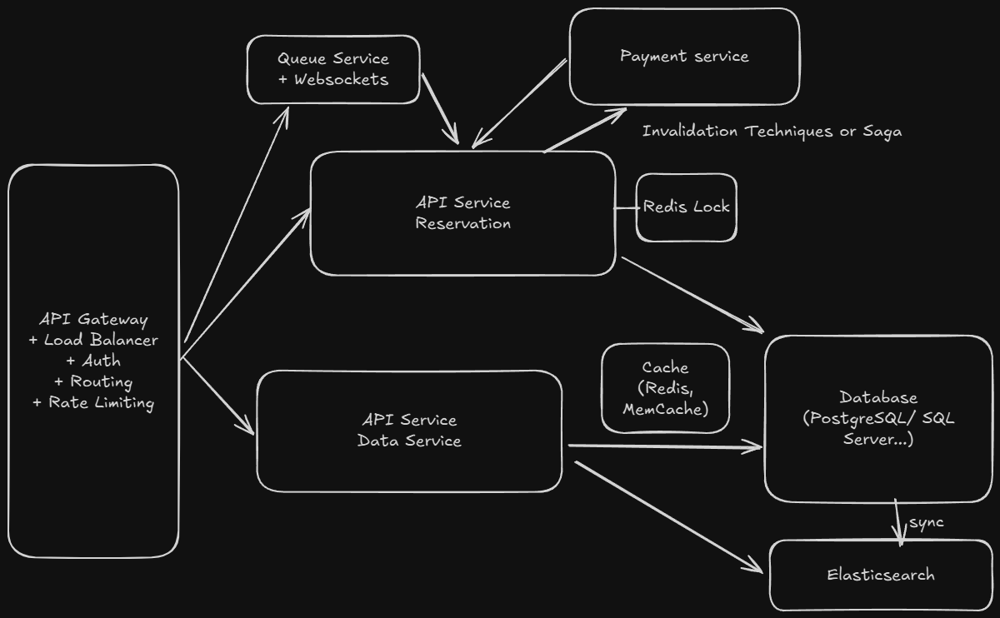

# Ticket Booking System Architecture

## System Overview

A ticket booking platform that allows users to purchase tickets for concerts, sports events, theater, and other live entertainment.

### Functional Requirements

1. Users should be able to view events
2. Users should be able to search for events  
3. Users should be able to book tickets to events

### Non-Functional Requirements

1. The system should prioritize availability for searching & viewing events, but should prioritize consistency for booking events (no double booking)
2. The system should be scalable and able to handle high throughput in the form of popular events (10 million users, one event)
3. The system should have low latency search (< 500ms)
4. The system is read heavy, and thus needs to be able to support high read throughput (100:1)

## System Architecture



## Data Models

1. **Event**: Stores essential information about an event, including details like the date, description, type, and the performer or team involved
2. **User**: Represents the individual interacting with the system
3. **Performer**: Represents the individual or group performing or participating in the event
4. **Venue**: Represents the physical location where an event is held, including address, capacity, and seat map
5. **Ticket**: Contains information related to individual tickets for events, including seat details, pricing, and status
6. **Booking**: Records the details of a user's ticket purchase, including user ID, ticket IDs, total price, and booking status

## Service Interfaces

### View Events
```
GET /events/:eventId -> Event & Venue & Performer & Ticket[]
```

### Search Events
```
GET /events/search?keyword={keyword}&start={start_date}&end={end_date}&pageSize={page_size}&page={page_number} -> Event[]
```

### Book Tickets
```
POST /bookings/:eventId -> bookingId
{
  "ticketIds": string[], 
  "paymentDetails": ...
}
```

### 1) Users should be able to view events

When a user navigates to www.ticketmaster.com/event/:eventId they should see details about that event. Crucially, this should include a seatmap showing available tickets with real-time availability updates.

**Components:**
- **Load Balancer**: Distribute requests across multiple servers
- **API Gateway**: Handle authentication, rate limiting, and routing
- **Event Service**: Serve event details from database
- **PostgreSQL**: Primary database for event and ticket data
- **Redis Cache**: Cache frequently accessed event data
- **CDN**: Cache static content and images globally

**Data Flow:**
1. User requests event details
2. API Gateway routes to Event Service
3. Event Service checks Redis cache
4. If cache miss, query PostgreSQL database
5. Return event details with available tickets
6. Cache response in Redis

**Seatmap Rendering:**
The frontend receives ticket data with section, row, and seat information to render an interactive seatmap. Each seat shows its current status (available, reserved, sold) and price tier.

### 2) Users should be able to search for events

Users need to search across events by keywords, dates, locations, and other filters with fast response times under 500ms.

**Components:**
- **Elasticsearch**: Search-optimized database for complex queries
- **Search Service**: Handle search logic and result formatting
- **Cache Layer**: Cache popular search results
- **CDN**: Geographic caching for search results

**Search Features:**
- Full-text search across event titles, descriptions, performer names
- Faceted filtering by date range, location, price, event type
- Autocomplete suggestions for popular search terms
- Geographic search by city or venue proximity
- Sort by relevance, date, price, or popularity

**Implementation:**
- Index events in Elasticsearch with fields: title, description, performer_name, venue_name, city, start_date
- Use faceted search for filtering by date range, location, price
- Cache search results for common queries with adaptive TTL
- Use CDN to cache search results geographically for non-personalized queries

### 3) Users should be able to book tickets to events

The most critical requirement - prevent double booking while handling high concurrency. This involves a two-phase booking process: reservation and confirmation.

**Components:**
- **Ticket Service**: Handle ticket reservations and status updates
- **Booking Service**: Process payments and create booking records
- **Payment Gateway**: Process credit card payments
- **Message Queue**: Handle asynchronous notifications
- **Notification Service**: Send booking confirmations

**Booking Process:**
1. **Reservation Phase**: User selects tickets and creates a temporary reservation
   - Set reservation timeout (15 minutes)
   - Mark tickets as RESERVED status
   - Store reservation in Redis with expiration
2. **Payment Phase**: User completes payment details
   - Process payment through gateway
   - Validate payment success
3. **Confirmation Phase**: Complete the booking
   - Update ticket status to SOLD
   - Create booking record in database
   - Send confirmation email
   - Release reservation locks

**Reservation Management:**
- Use distributed locks to prevent concurrent reservations
- Implement automatic cleanup for expired reservations
- Handle payment failures gracefully with ticket release

## Implementation Details

### Database Schema Design

**Ticket Status Management:**
```sql
-- Ticket status transitions
AVAILABLE -> RESERVED -> SOLD
AVAILABLE -> RESERVED -> AVAILABLE (on timeout)
RESERVED -> SOLD (on payment confirmation)
```

**Reservation Cleanup:**
```sql
-- Automatic cleanup of expired reservations
UPDATE tickets 
SET status = 'AVAILABLE', reserved_until = NULL, reserved_by = NULL 
WHERE status = 'RESERVED' AND reserved_until < NOW();
```

### Caching Strategy

**Multi-Level Caching:**
1. **Browser Cache**: Static event images and CSS
2. **CDN Cache**: Geographic distribution of event details
3. **Redis Cache**: Frequently accessed event data and search results
4. **Database Cache**: Query result caching in PostgreSQL

**Cache Invalidation:**
- Event updates invalidate related caches
- Ticket status changes invalidate availability caches
- Search index updates invalidate search result caches

## Technical Challenges

### Problem 1: Improving Booking Experience with Ticket Reservation

**Problem**: Users spend time filling out payment forms only to find tickets are no longer available.

**Solution: Distributed Lock with Reservation Timeout**
```python
def reserve_ticket_for_user(ticket_id, user_id, timeout_minutes=10):
    lock_key = f"ticket_reservation:{ticket_id}"
    reservation_data = {
        'user_id': user_id,
        'reserved_at': datetime.now(),
        'expires_at': datetime.now() + timedelta(minutes=timeout_minutes)
    }
    
    # Set distributed lock with TTL
    if redis.set(lock_key, json.dumps(reservation_data), nx=True, ex=timeout_minutes * 60):
        booking = create_booking_record(user_id, ticket_id, status='IN_PROGRESS')
        return booking.booking_id
    else:
        raise TicketNotAvailableException()
```
- 10-minute reservation timeout prevents double booking
- Automatic cleanup for abandoned checkouts

### Problem 2: Preventing Double Booking

**Problem**: Multiple users trying to book the same tickets simultaneously can result in overselling.

**Solution: Optimistic Concurrency Control**
```python
def reserve_tickets_optimistic(ticket_ids, user_id):
    for attempt in range(max_retries):
        # Get current ticket versions
        tickets = get_tickets_with_version(ticket_ids)
        
        # Validate all tickets are available
        if not all(t.status == 'AVAILABLE' for t in tickets):
            raise TicketsNotAvailableException()
        
        # Attempt to update with version check
        updated_count = update_tickets_optimistic(ticket_ids, user_id, [t.version for t in tickets])
        
        if updated_count == len(ticket_ids):
            return create_reservation(ticket_ids, user_id)
        else:
            # Conflict detected, retry
            time.sleep(random.uniform(0.01, 0.1))
```
- Highest performance and scalability
- Natural conflict resolution with retry logic
- No locks required, works well with distributed systems

### Problem 3: Scaling View API for High Traffic

**Problem**: Event pages get hammered when tickets go on sale - thousands of users refresh the same event page waiting for availability.

**Solution: Aggressive Caching Strategy**
```python
class EventViewService:
    def get_event_details(self, event_id):
        cache_key = f"event:{event_id}"
        cached_event = self.redis.get(cache_key)
        if cached_event:
            return json.loads(cached_event)
        
        event_data = self.db.get_event_with_tickets(event_id)
        self.redis.setex(cache_key, 3600, json.dumps(event_data))  # 1 hour
        return event_data
```
- Multi-level caching (Redis + CDN)
- Horizontal scaling with load balancers
- Long TTL for static data, short for dynamic data

### Problem 4: Real-time Seatmap Updates

**Problem**: During high-demand events, seatmap becomes stale quickly as users repeatedly click on already-booked seats.

**Solution: Virtual Waiting Room**
```python
def join_waiting_room(self, user_id, event_id):
    queue_key = f"waiting_room:{event_id}"
    position = self.redis.lpush(queue_key, user_id)
    return {
        'position': position,
        'estimated_wait_time': self.estimate_wait_time(event_id, position)
    }
```
- Fair access to ticket purchasing
- Prevents system overload
- Manages user expectations with wait times

### Problem 5: High-Performance Search

**Problem**: Users expect fast search results (under 500ms) across large event catalogs.

**Solution: Elasticsearch with Multi-Level Caching**
```python
def search_events_cached(query_params):
    cache_key = generate_cache_key(query_params)
    cached_result = redis.get(cache_key)
    if cached_result:
        return json.loads(cached_result)
    
    search_result = elasticsearch_search(query_params)
    redis.setex(cache_key, get_cache_ttl(query_params), json.dumps(search_result))
    return search_result
```
- Elasticsearch for complex search queries
- Redis caching for popular searches
- CDN for global content delivery
- < 500ms response time guaranteed

### Problem 6: Handling Popular Events

**Problem**: Popular events can generate massive traffic spikes (10 million users).

**Solution: Auto-Scaling with Circuit Breakers**
```python
@circuit_breaker
async def reserve_tickets(self, ticket_ids, user_id):
    if await self.is_high_load():
        return await self.handle_high_load_scenario(ticket_ids, user_id)
    return await self.process_reservation(ticket_ids, user_id)

async def auto_scale_services(self):
    metrics = await self.collect_metrics()
    if metrics['cpu_usage'] > 70:
        await self.scale_up_services()
    elif metrics['cpu_usage'] < 30:
        await self.scale_down_services()
```
- Automatic scaling based on load metrics
- Circuit breakers prevent cascading failures
- Graceful degradation during overload

### Problem 7: Virtual Waiting Queue for High-Frequency Events

**Problem**: Extremely popular events (like Taylor Swift concerts) can overwhelm the system with millions of simultaneous users trying to access the booking interface.

**Solution: Admin-Enabled Virtual Waiting Queue**
```python
def join_queue(self, user_id, event_id, websocket_connection):
    queue_key = f"virtual_queue:{event_id}"
    queue_data = {
        'user_id': user_id,
        'joined_at': datetime.now(),
        'websocket_id': websocket_connection.id
    }
    
    position = self.redis.lpush(queue_key, json.dumps(queue_data))
    self.ws_manager.send_to_connection(websocket_connection, {
        'type': 'queue_joined',
        'position': position,
        'estimated_wait_time': self.calculate_wait_time(event_id, position)
    })
    return position

def process_queue(self, event_id, batch_size=100):
    queue_key = f"virtual_queue:{event_id}"
    for _ in range(batch_size):
        user_data = self.redis.rpop(queue_key)
        if user_data:
            user_info = json.loads(user_data)
            self.ws_manager.send_to_user(user_info['websocket_id'], {
                'type': 'queue_advance',
                'message': 'You can now proceed to purchase tickets'
            })
            self.grant_ticket_access(user_info['user_id'], event_id)
```

**Key Features:**
- Real-time WebSocket updates for queue position
- Batch processing to control system load
- Admin control for enabling/disabling queues
- Fair access with estimated wait times

### Component Responsibilities

**API Gateway:**
- Request routing and load balancing
- Authentication and authorization
- Rate limiting and throttling
- Request/response transformation

**Event Service:**
- Serve event details and metadata
- Handle search queries and filtering
- Manage event cache invalidation
- Coordinate with search index updates

**Ticket Service:**
- Manage ticket inventory and availability
- Handle reservation and booking operations
- Implement double booking prevention
- Coordinate ticket status updates

**Booking Service:**
- Process payment transactions
- Create and manage booking records
- Send confirmation notifications
- Handle booking cancellations and refunds

**Data Storage:**
- **PostgreSQL**: Transactional data with ACID guarantees
- **Elasticsearch**: Search-optimized indexing and querying
- **Redis**: High-performance caching and session management
- **Kafka**: Asynchronous event processing and notifications

## Architecture Summary

**Key Design Principles:**
- **Microservices Architecture**: Independent scaling and deployment
- **Multi-Database Strategy**: PostgreSQL (transactions), Elasticsearch (search), Redis (caching)
- **Optimistic Concurrency Control**: High-performance ticket reservations
- **Hybrid Caching**: Redis + CDN for optimal performance
- **Auto-Scaling**: Dynamic scaling for popular events
- **Circuit Breakers**: Prevent cascading failures

This design handles the core challenges of a ticket booking system while maintaining high performance, scalability, and data consistency.
